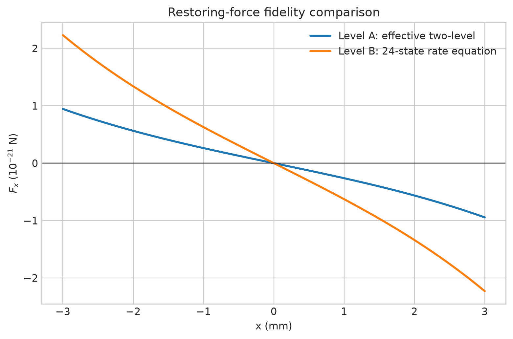
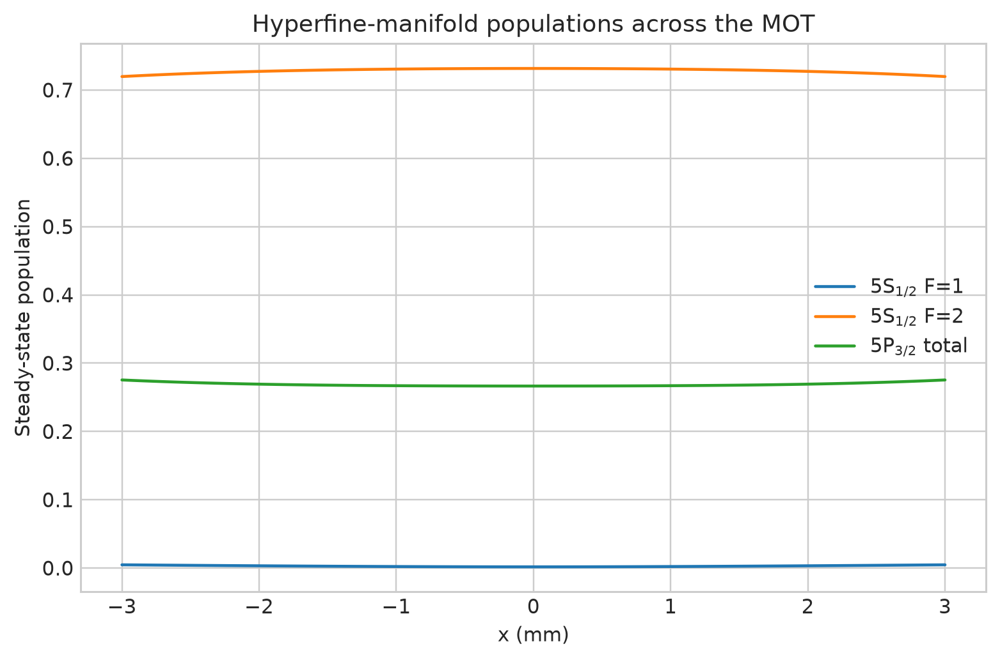

# Cold Atom MOT Simulations

A physically documented, reproducible 3D simulation framework for a six-beam
rubidium-87 vapour-cell magneto-optical trap (MOT). The current framework
implements ideal/coil magnetic fields, an effective two-level semiclassical
radiation-pressure model, adaptive deterministic trajectories, discrete
photon-event Monte Carlo trajectories, and a **Phase-2 multilevel population
rate-equation model** with explicit cooling and repump light.

This is scientific software under active development—not experiment-control
software and not a quantitatively calibrated prediction of a particular MOT.
The implemented approximation level and missing physics are stated explicitly.

## Phase-1 capabilities

- sourced 87Rb D2 mass, wavelength, lifetime, linewidth, saturation convention,
  recoil scales, hyperfine intervals, Landé factors and normalized hyperfine
  strengths;
- six independent 3D Gaussian travelling beams with power, waist, origin,
  direction, detuning, frequency offset, propagation-relative helicity and
  polarization purity;
- local σ−/π/σ+ polarization decomposition about an arbitrary quantization axis;
- ideal rotated quadrupole fields and composable uniform/gradient/AC stray fields;
- geometrical anti-Helmholtz coils evaluated by converged segmented-wire
  Biot–Savart integration, including tilt, displacement and current imbalance;
- Level-A shared-saturation force with Gaussian intensity, Doppler shift, signed
  Zeeman shift, per-beam momentum transfer and an arbitrary gravity vector;
- adaptive RK45 mean-force trajectories;
- seeded photon-event trajectories with responsible-beam selection, absorption
  momentum and isotropic spontaneous-emission recoil;
- validated YAML configuration, CLI execution and NPZ result data with metadata.

## Phase-2 capabilities

- explicit 24-state 87Rb D2 hyperfine/Zeeman population basis;
- Clebsch–Gordan strengths generated from a tested Racah implementation;
- normalized spontaneous branching derived from the same dipole elements;
- independent six-beam cooling and repump families;
- local polarization components and state-resolved hyperfine, Zeeman and Doppler shifts;
- conservative stationary rate equations and population-resolved radiation force;
- repump-power, manifold-population, Zeeman-population and force diagnostics.

## Fidelity and limitations

| Level | Physical model | Repository status |
|---|---|---|
| A | Effective two-level Doppler/scattering force | **Implemented** |
| B | Multilevel hyperfine/Zeeman rate equations + repump | **Implemented** |
| C | Multilevel optical Bloch equations | Phase 3 roadmap |
| D | Phase-resolved polarization-gradient/sub-Doppler model | Phase 4 roadmap |
| E | Vapour loading, collision loss and experiment calibration | Phase 5 roadmap |

Level A does **not** model optical pumping, dark states, coherences, repump
dynamics, polarization-gradient cooling, reabsorption, multiple scattering,
loading, collision loss or experimental imperfections not explicitly configured.
It must not be used to claim a sub-Doppler temperature or calibrated atom number.
See [theory](docs/theory.md), [numerics](docs/numerical_methods.md),
[validation](docs/validation.md), and [references](docs/references.md).

Level B explicitly evolves all 24 populations in the 87Rb D2 F=1,2 and
F′=0,1,2,3 Zeeman basis. It includes cooling/repump absorption, stimulated
emission, state-resolved Zeeman shifts and normalized spontaneous branching.
It remains an incoherent rate equation: it cannot reproduce coherent dark
states, light shifts, OBEs, or polarization-gradient/sub-Doppler cooling.

## Reproducible quick run

Install the package and execute the committed SI-unit configuration:

```bash
python -m pip install -r requirements-dev.txt
python -m cold_atom_mot simulate configs/rb87_standard_mot.yaml
python -m cold_atom_mot rate-equation configs/rb87_phase2_rate_equation.yaml
```

The commands write `results/phase1/phase1_run.npz`, including deterministic and
Monte Carlo arrays plus JSON metadata recording configuration, units, model
fidelity, solver, seed, atom number, time step and package version, and
`results/phase2/phase2_rate_equation.npz`, containing the Level-B force and
manifold-population profile with corresponding metadata.

Regenerate the documented reference dataset and every PNG/SVG pair with:

```bash
python examples/generate_phase1_results.py
python examples/generate_phase2_results.py
```

## Selected simulation results

The complete Phase-1 and Phase-2 gallery, parameters, interpretations, SVG alternatives,
and numerical-data links are collected in **[results/README.md](results/README.md)**.
The curated figures below provide an immediate scientific overview.

### Phase-2 hyperfine populations and force

| 24-state force comparison | Cooling/repump populations |
|---|---|
|  |  |
| Effective two-level versus population-resolved force. [Caption, SVG and data](results/README.md#phase-2-multilevel-rate-equation-results) | F=1, F=2 and excited populations across the MOT. [Caption, SVG and data](results/README.md#phase-2-multilevel-rate-equation-results) |

### Apparatus and physical magnetic field

| Six-beam/coil geometry | Segmented Biot–Savart field |
|---|---|
|  |  |
| Independent beam propagation and 40 mm anti-Helmholtz geometry. [Caption and SVG](results/README.md#1-apparatus-geometry) | Physical y=0 field map from 256 segments per loop. [Caption, SVG and data](results/README.md#2-geometrical-anti-helmholtz-magnetic-field) |

### Force and trajectories

| Level-A force surface | Adaptive 3D dynamics |
|---|---|
|  |  |
| $F_x(x,v_x)$ at −2 Γ, 10 mW/beam and 0.10 T/m. [Caption, SVG and data](results/README.md#3-deterministic-force-map) | Three 4 ms RK45 mean-force trajectories. [Caption and SVG](results/README.md#4-adaptive-deterministic-trajectories) |

### Stochastic convergence


The fixed-seed 32–512 atom study displays sampling uncertainty rather than a
claimed equilibrium temperature. [Read the interpretation and access SVG/data.](results/README.md#5-photon-event-monte-carlo-convergence)

These are documented model diagnostics, not fitted experimental results.

## Package map

```text
src/cold_atom_mot/
  atomic/rb87.py             sourced constants and derived recoil scales
  laser/beam.py              independent Gaussian beams and six-beam geometry
  laser/polarization.py      propagation/local spherical polarization bases
  magnetic/fields.py         ideal quadrupole and residual fields
  magnetic/coils.py          segmented-wire circular coils
  physics/force.py           documented Level-A radiation-pressure force
  solvers/deterministic.py   adaptive mean-force trajectories
  solvers/monte_carlo.py     discrete photon events and recoil
  io/config.py               validated YAML configuration
  cli.py                     reproducible command-line runs
```

No empty OBE, rate-equation or sub-Doppler modules are included merely to imply
capabilities that do not yet exist.

## Validation and tests

```bash
python -m pytest -q
python -m compileall src tests
git diff --check
```

The tests cover power normalization, polarization conventions, opposite photon
momenta, Maxwell-consistent gradients, anti-Helmholtz symmetry and segmentation
convergence, coil-error field-zero motion, restoring/damping force symmetry,
3D integration, recoil statistics, fixed-seed reproducibility and timestep
refinement.  CI uses `python -m pytest -q`; expensive research scans are excluded.

## Foundational models

The original `cold_atom.py` remains as an educational collection of ballistic,
thermal-velocity and Gaussian optical-dipole-trap formulas.  It is intentionally
kept separate from the flagship MOT package because those calculations describe
different physical systems and approximation levels.

## Roadmap

1. **Phase 2 validation extension:** matched PyLCP rate-equation comparisons under
   identical bases, linewidth, intensity and polarization conventions.
2. **Phase 3:** documented Hamiltonian/Lindblad OBE backend with tolerance studies
   and selected PyLCP cross-validation.
3. **Phase 4:** phase-resolved six-beam polarization gradients, light shifts,
   Sisyphus dynamics, diffusion and residual-field suppression studies.
4. **Phase 5:** sourced Rb vapour pressure, independently specified background
   pressure, trajectory-derived capture, loading/loss and experiment calibration.
