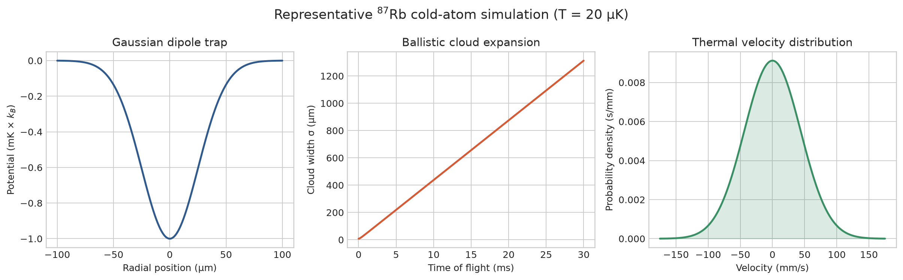

# Cold Atom Simulations

A physics-first collection of compact numerical models for cold-atom experiments and atomic trapping.

The current project starts with idealized models for ballistic motion, thermal velocity scales, Gaussian optical dipole traps, harmonic trap frequencies, and gravitational sag. The goal is to build transparent computational tools that connect directly to experimentally relevant cold-atom parameters.

## Implemented

- 1D ballistic/free-fall trajectories
- thermal velocity standard deviation from temperature and atomic mass
- Gaussian-beam waist evolution
- ideal Gaussian optical-dipole potential
- radial and axial harmonic trap frequencies near the trap center
- gravitational sag in a harmonic trap
- reproducible example results and plots for a representative rubidium-87 trap
- unit tests and CI

## Example simulation results

The repository includes a reproducible example for rubidium-87 atoms in a
1064 nm Gaussian optical dipole trap. With a 50 micrometre beam waist and a
1 mK trap depth, the model predicts radial and axial trap frequencies of
approximately 2.0 kHz and 9.4 Hz, respectively. A 20 microkelvin ensemble has
a one-dimensional thermal velocity spread of about 44 mm/s.



The figure shows the Gaussian trap potential, ballistic expansion after
release, and the associated thermal velocity distribution. Numerical values
are recorded in [`results/summary.md`](results/summary.md). Recreate both
artifacts from the repository root with:

```bash
python results/generate_results.py
```

## Roadmap

- MOT force and Doppler cooling models
- optical molasses
- magnetic quadrupole and harmonic traps
- Monte Carlo atomic ensembles
- time-of-flight thermometry
- dipole-trap loading and evaporation models
- trap-depth and scattering-rate studies
- links to atom-interferometer initial-condition simulations

## Repository provenance

**The current cold-atom simulation implementation began in 2026.** This repository was repurposed from a detached study/reference repository. Its earlier state is preserved on `backup/pre-repurpose-2026-08-10`; the default branch is now maintained as new portfolio work.

## Scope

The models are deliberately compact and educational/research-oriented. They are not intended as experiment-control software or as a substitute for a full atomic-physics simulation package.
