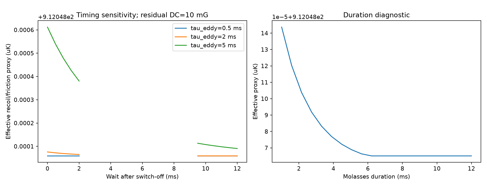

# Part III — Motion, loading, and collective physics

After the internal-state calculation supplies a force, the simulation turns that force into experimentally recognizable observables: trajectories, capture probability, loading curves, sequence timing and collective-cloud trends.

# 11. Classical motion and photon recoil

Once a force model is available, external atomic motion is treated semiclassically:

$$
\frac{d\mathbf r}{dt}=\mathbf v,
\qquad
m\frac{d\mathbf v}{dt}=\mathbf F(\mathbf r,\mathbf v,t).
$$

The deterministic solver uses adaptive RK45.

## Photon-event Monte Carlo

A stochastic alternative samples scattering events. Absorption from beam $i$ changes momentum by

$$
\Delta\mathbf p_\mathrm{abs}=+\hbar\mathbf k_i.
$$

Spontaneous emission adds a recoil of magnitude $\hbar k$ in an isotropically sampled direction. The mean spontaneous recoil is zero while its component variance is one third of the squared recoil magnitude.

The current Bernoulli event step is required to satisfy

$$
R_\mathrm{tot}\Delta t\lesssim0.1
$$

so that the probability of more than one unrepresented event in a step remains small.

This stochastic solver includes recoil diffusion naturally, but short trajectories are not automatically an equilibrium-temperature calculation.

**Numerical decision.** Deterministic trajectories use adaptive RK45 because the mechanical timescale varies along the path. The photon-event solver instead uses a deliberately small step constrained by $R_\mathrm{tot}\Delta t\lesssim0.1$ so that its one-event-per-step Bernoulli approximation remains controlled. A fixed random seed is stored for reproducibility.

**Result.** The effective model produces damped/restoring trajectories in the MOT geometry; stochastic runs add the expected recoil broadening without changing the mean spontaneous-emission recoil.

---
# 12. Time-dependent experimental sequence

A real experiment does not keep one MOT configuration on forever. The repository therefore represents a sequence such as

**vapour MOT loading**
→ **compressed MOT**
→ **gradient switch-off**
→ **field settling**
→ **PGC ramp**
→ **molasses hold**
→ **release / time of flight**.

Controls can be step, linear or smooth ramps.

The illustrative reference sequence changes cooling detuning, cooling power, repump power and quadrupole gradient in time. It is explicitly labelled as an illustrative sequence, not an experimentally optimized recipe.

## Coil and eddy-current response

After switch-off, an example gradient response is

$$
G(t)=G_0e^{-(t-t_\mathrm{off})/\tau_\mathrm{coil}},
$$

while a residual field can contain

$$
\mathbf B(t)=\mathbf B_\mathrm{DC}
+\mathbf B_\mathrm{eddy}e^{-(t-t_\mathrm{off})/\tau_\mathrm{eddy}}
+\mathbf B_\mathrm{AC}\sin(2\pi ft+\phi).
$$

This is important for sub-Doppler cooling: even if the quadrupole current command is zero, eddy currents and uncompensated bias can remain during the molasses stage.

The committed timing figure uses an effective damping/recoil proxy. It is **not** labelled as a coherent PGC temperature.

**Decision.** Timing is a separate layer because the state of the apparatus at the start of molasses depends on the *history* of gradients, powers and eddy currents, not only on their nominal final values. Keeping the sequence explicit prevents an instantaneous “field off” command from being confused with a physically settled field.

**Result.** The generated timeline shows MOT loading, compression, switch-off, field settling, PGC ramp, molasses and TOF together with timing/field-settling sensitivity.

---
# 13. From a MOT force to vapour-cell capture

A vapour-cell MOT is loaded from thermal atoms. Most thermal atoms are much too fast to capture, so loading is a rare-tail problem.

## 13.1 Rubidium vapour pressure

When pressure is not supplied directly, the code uses the stored Alcock-Itkin-Horrigan natural-rubidium fit. In the implemented validity range:

solid branch:

$$
\log_{10}P[\mathrm{Pa}]=7.738-\frac{4215}{T},
$$

liquid branch:

$$
\log_{10}P[\mathrm{Pa}]=7.193-\frac{4040}{T}.
$$

The code separates three temperatures because they need not be identical in a real apparatus:

- reservoir/cold-spot temperature: controls equilibrium Rb pressure;
- vapour kinetic temperature: controls Rb number density and velocity distribution;
- background-gas temperature: controls background collision kinetics.

Number density is

$$
n=\frac{P}{k_BT}.
$$

## 13.2 One-sided thermal flux

The equilibrium flux crossing a surface from one side is

$$
\frac{\Phi}{A}
=n\sqrt{\frac{k_BT}{2\pi m}}
=\frac{n\langle v\rangle}{4}.
$$

The speed distribution of atoms **crossing the surface** is not the ordinary bulk Maxwell speed law. Flux weighting adds one power of velocity:

$$
p_\mathrm{flux}(v)\propto v^3
\exp\left(-\frac{mv^2}{2k_BT}\right).
$$

Incidence directions follow the cosine/Lambert law.

### Why this matters

If one sampled from the ordinary $v^2$ Maxwell distribution, the incident ensemble would be statistically wrong. Since capture lives in the extremely slow thermal tail, this mistake would strongly bias the loading rate.

## 13.3 Capture criterion

A sampled trajectory is called captured only if it remains inside a configured radius and below a configured speed for a minimum dwell time. The reference acceptance criterion is an explicit numerical definition; it is not claimed to be a physical chamber wall.

The loading rate is

$$
R=\Phi_\mathrm{incident}\,P_\mathrm{capture}.
$$

## 13.4 Rare-event statistics

Slow capturable atoms are rare, so simple unstratified Monte Carlo would often return zero captures with misleading zero uncertainty. The repository therefore uses speed strata with exact thermal-flux weights and Wilson confidence intervals.

The high-speed tail is extended adaptively. A zero-capture final stratum is not interpreted as proof of zero capture; a Wilson upper bound is propagated into an upper bound on the unresolved loading contribution.

A response map

$$
P_\mathrm{capture}(v,b)
$$

is also generated as a function of incident speed and impact parameter. This separates the mechanical capture response from the temperature-dependent incident flux distribution.

**Numerical/statistical decision.** Capture is a rare-tail problem, so the code does not rely on a small unstratified Maxwell sample. It stratifies incident speed, uses the correct flux weighting, assigns exact stratum probabilities, and propagates Wilson confidence bounds. This is specifically designed to avoid reporting “zero capture” merely because no rare slow atom happened to appear in a small sample.

**Result.** The response map makes the capture boundary visible in incident speed and impact parameter, while the convergence figure shows how the stratified estimate and unresolved high-speed tail are bounded.

---
# 14. Loading and loss equations

For a constant loading rate and one-body loss,

$$
\frac{dN}{dt}=R-\gamma N.
$$

For $N(0)=N_0$,

$$
N(t)=\frac{R}{\gamma}
+\left(N_0-\frac{R}{\gamma}\right)e^{-\gamma t}.
$$

The steady state is

$$
N_\mathrm{ss}=\frac{R}{\gamma}.
$$

With two-body loss,

$$
\frac{dN}{dt}
=R-\gamma N-\beta\int n^2(\mathbf r)d^3r.
$$

For a Gaussian cloud with RMS widths $\sigma_x,\sigma_y,\sigma_z$,

$$
\int n^2dV
=\frac{N^2}
{8\pi^{3/2}\sigma_x\sigma_y\sigma_z}.
$$

Therefore the effective two-body volume is

$$
V_{2,\mathrm{eff}}
=8\pi^{3/2}\sigma_x\sigma_y\sigma_z.
$$

### Important design decision

The code **does not invent** background-collision cross sections, hot-Rb loss coefficients or two-body $\beta$. These must be supplied from literature or experiment. This keeps a calculated loading rate from being disguised as a calibrated atom-number prediction.

**Result.** The repository combines the sourced vapour-pressure/thermal-flux calculation with trajectory-derived $P_\mathrm{capture}$ to obtain loading-rate scenarios, and then shows how independently supplied loss terms change $N(t)$. The plotted atom number is therefore a scenario conditioned on explicit loss inputs, not an automatically calibrated experimental prediction.

---
# 15. Optional collective-cloud physics

At large atom number, atoms are no longer completely independent. The optional collective model introduces a Gaussian continuum characterized by atom number, widths, density and optical depth.

For a Gaussian cloud,

$$
n_0=\frac{N}{(2\pi)^{3/2}\sigma_x\sigma_y\sigma_z}.
$$

## Multiple scattering

A Walker/Sesko/Wieman-style mean-field approximation uses

$$
F_\mathrm{ms}(r)=Q\frac{N_\mathrm{enclosed}(r)}{r^2},
$$

with

$$
Q=\frac{\sigma_L\sigma_R I}{4\pi c}.
$$

The cross sections and intensity are physical inputs rather than an arbitrary repulsion constant.

## Shadowing and radiation trapping

Beer-Lambert attenuation uses optical depth. A simple reabsorption probability proxy is

$$
P_\mathrm{reabs}\approx1-e^{-\mathrm{OD}_R}.
$$

This can be used to estimate additional recoil diffusion.

### Approximation boundary

This is not full radiative transfer. It omits repeated scattering, detailed frequency redistribution, polarization-dependent transport, anisotropic photon escape and cloud deformation. The model is useful for studying trends such as density limitation and cloud expansion, not for claiming exact large-MOT photon transport.

**Decision.** This is a mean-field extension, not an $N$-body photon-transport simulation. The model was chosen because it can expose when independent-atom loading breaks down without pretending to solve full radiative transfer.

**Result.** The committed scenario shows loading saturation, cloud expansion, density limitation, optical depth, shadow-force and multiple-scattering scales while recovering the independent-atom limit when collective terms are disabled.

---
