# From one rubidium atom to a MOT: a continuous equation-to-result tutorial

This is the **primary learning document** for the repository. It is meant to be read from top to bottom like a worked physics calculation, not like software documentation.

The pattern is deliberately repeated throughout:

> **physical question → define the symbols → governing equation → why this model → numerical/tool decision → approximation → calculated result → interpretation → why the next model is needed**

For an exhaustive cross-repository list of governing equations and symbols, use the [notation and equation inventory](00_notation_and_equation_inventory.md). For a quick visual review of the main equations, use the [equation visual atlas](equation_visual_atlas.md).

> **Scope / provenance.** This repository is independent after-hours work developed from personal scientific interest and kept as a reproducible record and backup. Laboratory control, acquisition, and other lab codes are not kept here.

---

# 1. What are we trying to calculate?

A magneto-optical trap (MOT) must do two jobs simultaneously:

1. **cool** an atom, meaning the average light force should oppose its velocity;
2. **trap** an atom, meaning the average force should point back toward the trap centre when the atom is displaced.

Near the centre of an ideal MOT we therefore hope to obtain a force of the form

$$
F_x\approx-\kappa x-\beta_v v_x.
$$

Here:

- $x$ is displacement from the trap centre;
- $v_x$ is velocity;
- $\kappa>0$ is the MOT spring constant;
- $\beta_v>0$ is the velocity-damping coefficient.

The subscript on $\beta_v$ matters: later, $\beta_2$ will denote a **two-body loss coefficient**, which is an entirely different physical quantity.

This simple expression is the destination of the first part of the calculation, not the starting assumption. To calculate $\kappa$ and $\beta_v$, we first need the atom, its allowed optical transitions, the laser fields and the magnetic field.

---

# 2. Choose a real atom: why $^{87}$Rb D2?

The main reference system is

$$
^{87}\mathrm{Rb}:\qquad5S_{1/2}\rightarrow5P_{3/2}\quad(D_2),
$$

with wavelength

$$
\lambda=780.241209686\ \mathrm{nm}.
$$

The reference cooling transition is

$$
F=2\rightarrow F'=3,
$$

and the repump transition is

$$
F=1\rightarrow F'=2.
$$

## Why this choice?

The $F=2\rightarrow F'=3$ D2 line contains a strong stretched-state cycling transition and is a standard starting point for a conventional rubidium MOT. Choosing one fully specified isotope/line also makes the simulation auditable before attempting several partially supported systems.

The repository contains atomic data for $^{85}$Rb and both D lines too, but it does **not** pretend that D1 gray molasses is obtained simply by changing $\lambda$. D1 gray molasses involves coherent $\Lambda$-system/Raman dark-state physics and therefore needs a dedicated coherent model.

## Natural scales

Define:

- $\tau$: excited-state lifetime;
- $\Gamma=1/\tau$: spontaneous population-decay rate;
- $h$: Planck constant;
- $\hbar=h/(2\pi)$;
- $k_B$: Boltzmann constant;
- $m$: atomic mass;
- $k=2\pi/\lambda$: optical wave number.

For the stored $^{87}$Rb D2 lifetime,

$$
\tau=26.2348\ \mathrm{ns},
$$

so

$$
\Gamma=\frac1\tau\approx3.8117\times10^7\ \mathrm{s^{-1}},
$$

and

$$
\frac{\Gamma}{2\pi}\approx6.0666\ \mathrm{MHz}.
$$

The familiar two-level Doppler temperature scale is

$$
T_D=\frac{\hbar\Gamma}{2k_B}\approx145.6\ \mu\mathrm K.
$$

The single-photon recoil velocity and recoil temperature are

$$
v_r=\frac{\hbar k}{m}\approx5.88\ \mathrm{mm/s},
$$

$$
T_r=\frac{(\hbar k)^2}{2mk_B}\approx0.181\ \mu\mathrm K.
$$

These numbers tell us immediately that a tens-of-$\mu$K molasses result is genuinely sub-Doppler but still far above a single recoil quantum.

**Implementation decision.** Atomic constants are stored once in `atomic/species.py`, and all later models derive $\Gamma$, $k$, recoil scales and hyperfine offsets from this common source. This prevents different solvers from quietly using different atomic constants.

---

# 3. Build the hyperfine energy levels

## Physical question

A real rubidium atom is not a two-level system. Before asking which laser is resonant, we need the energy of each hyperfine level.

## 3.1 What do $I$, $J$, $F$, $A_{\rm hfs}$ and $B_{\rm hfs}$ mean?

The angular momenta are:

- $I$: **nuclear spin**. For $^{87}$Rb, $I=3/2$;
- $J$: **total electronic angular momentum** within one fine-structure manifold;
- $F$: **total hyperfine angular momentum**, defined by $\mathbf F=\mathbf I+\mathbf J$;
- $m_F$: projection of $F$ on a chosen quantization axis.

The allowed values satisfy

$$
F=|I-J|,|I-J|+1,\ldots,I+J.
$$

For $5S_{1/2}$, $J=1/2$, hence $F=1,2$. For $5P_{3/2}$, $J=3/2$, hence $F'=0,1,2,3$.

Now define

$$
K\equiv F(F+1)-I(I+1)-J(J+1).
$$

Why does $K$ appear? Because

$$
\mathbf I\cdot\mathbf J
=\frac12\left[F(F+1)-I(I+1)-J(J+1)\right]
=\frac K2.
$$

The symbol $A_{\rm hfs}$ is the **magnetic-dipole hyperfine constant**. It sets the energy scale of the nuclear-electronic magnetic interaction. Its contribution is

$$
\frac{E_A}{h}=\frac{A_{\rm hfs}}{2}K.
$$

The symbol $B_{\rm hfs}$ is the **electric-quadrupole hyperfine constant**. It is not the magnetic field. The magnetic field will always be written as the vector $\mathbf B$.

When both $I\ge1$ and $J\ge1$, the repository uses the complete hyperfine energy

$$
\frac{E_{\rm hfs}}{h}
=
\frac{A_{\rm hfs}}{2}K
+
B_{\rm hfs}
\frac{\frac34K(K+1)-I(I+1)J(J+1)}
{2I(2I-1)J(2J-1)}.
$$

For the ground $5S_{1/2}$ state, $J=1/2$, so no rank-two electronic quadrupole moment exists and the quadrupole term is absent. For $5P_{3/2}$ it is retained.

## Worked check: the 6.835-GHz ground splitting

For $^{87}$Rb $5S_{1/2}$,

$$
A_{\rm hfs}=3.417341305452145\ \mathrm{GHz}.
$$

For $F=2$,

$$
K_2=1.5,
$$

while for $F=1$,

$$
K_1=-2.5.
$$

Therefore

$$
\frac{E_{F=2}-E_{F=1}}{h}
=\frac{A_{\rm hfs}}2(K_2-K_1)
=2A_{\rm hfs}
\approx6.83468\ \mathrm{GHz}.
$$

That large ground splitting becomes important later: it is why the cooling and repump carriers can be placed in separate rotating blocks instead of explicitly integrating a multi-GHz optical beat.

### Equation picture

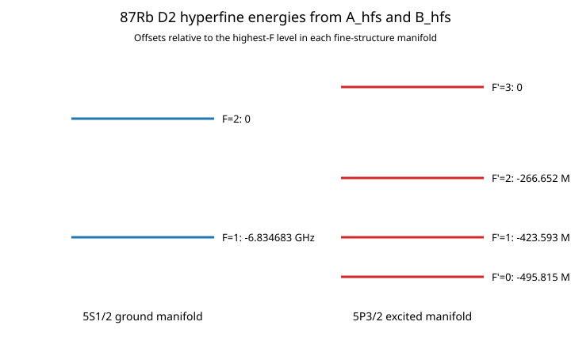

## 3.2 From hyperfine levels to individual optical transitions

The electric-dipole rules are

$$
\Delta F=0,\pm1,
\qquad
F=0\not\leftrightarrow F'=0,
$$

and

$$
m_F'=m_F+q,
\qquad q\in\{-1,0,+1\}.
$$

The three $q$ values correspond to $\sigma^-$, $\pi$ and $\sigma^+$ light relative to the chosen quantization axis.

The reduced hyperfine strength is generated from a Wigner 6-j symbol,

$$
S_{F\rightarrow F'}
\propto
(2F'+1)(2J_g+1)
\begin{Bmatrix}
J_e&F'&I\\
F&J_g&1
\end{Bmatrix}^2,
$$

and the Zeeman-resolved strength contains the Clebsch-Gordan coefficient,

$$
S_{Fm\rightarrow F'm'}
\propto
S_{F\rightarrow F'}
\left|\langle F,m;1,q|F',m'\rangle\right|^2.
$$

### Why use SymPy here?

These angular-momentum coefficients are exact algebraic objects and easy to transcribe incorrectly by hand. The repository therefore uses SymPy's Wigner 6-j and Clebsch-Gordan routines to **generate** the transition graph. NumPy is then used for the numerical arrays.

### Result

For $^{87}$Rb D2 the code obtains:

- 8 ground Zeeman states: 3 in $F=1$ and 5 in $F=2$;
- 16 excited Zeeman states in $F'=0,1,2,3$;
- 24 states total.

A full density matrix therefore has

$$
24\times24=576
$$

complex entries before exploiting physical constraints. This computational cost is the first reason we will keep lower-fidelity models as well as the full OBE.

---

# 4. Add the magnetic field

## Physical question

Velocity dependence alone cools atoms but does not locate a trap centre. A MOT uses a magnetic-field gradient to make the resonance position dependent.

## 4.1 Ideal quadrupole

Let $b'$ be the radial magnetic-field gradient, $\mathbf r_0$ the field zero and $R$ an optional rotation matrix. The ideal field is

$$
\mathbf B(\mathbf r)=
R\,\mathrm{diag}(b',b',-2b')R^T(\mathbf r-\mathbf r_0).
$$

The trace of its gradient is zero,

$$
\nabla\cdot\mathbf B=0,
$$

which is the Maxwell constraint in the source-free trapping volume.

The reference simulation uses

$$
b'=0.10\ \mathrm{T/m}=10\ \mathrm{G/cm}.
$$

**Decision.** Use this analytical field for fast calculations. It is Maxwell consistent and cheap to evaluate.

## 4.2 Physical coils when apparatus details matter

When coil geometry matters, the field is calculated from the Biot-Savart law,

$$
d\mathbf B=
\frac{\mu_0 I_cN_t}{4\pi}
\frac{d\boldsymbol\ell\times(\mathbf r-\mathbf r')}{|\mathbf r-\mathbf r'|^3}.
$$

Here $I_c$ is **coil current** (not nuclear spin), $N_t$ is the number of turns, $\mathbf r'$ is a source point on the conductor and $\mathbf r$ is the observation point.

The code segments circular coils numerically so radius error, separation error, tilt, displacement, turns mismatch and current imbalance can be represented.

For measured compensation coils, a general calibration is

$$
\mathbf B=M\mathbf I_c+\mathbf B_{\rm offset},
$$

where $M$ is a measured $3\times3$ response matrix. Least squares is used instead of assuming three perfectly orthogonal bias coils.

### Actual apparatus result

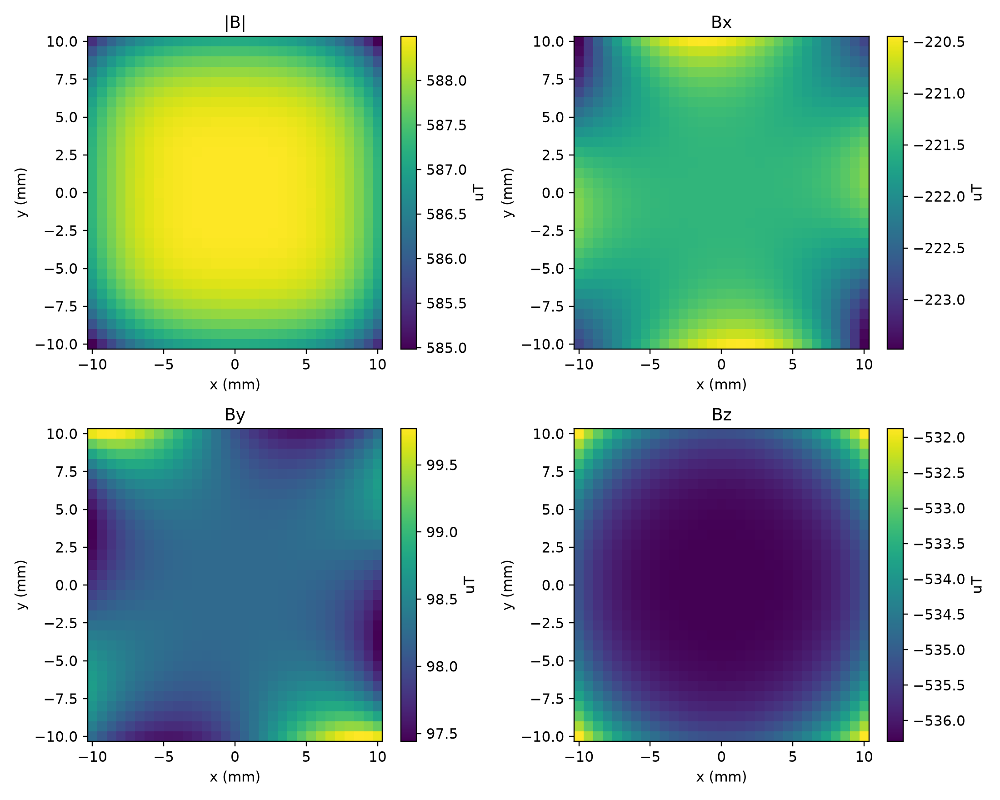

The committed calibration is a reproducible synthetic example rather than a measured laboratory calibration.

## 4.3 Why the scalar Zeeman shift is eventually insufficient

At weak field one often writes

$$
\Delta E\approx g_F\mu_Bm_FB,
$$

where $g_F$ is the hyperfine Landé factor and $\mu_B$ is the Bohr magneton. This is fine for a fast scalar model, but it cannot correctly describe an arbitrary transverse field because such a field can mix $m_F$ states.

The coherent layer therefore uses

$$
H=H_{\rm hfs}+H_Z,
$$

with

$$
H_Z=\mu_B(g_J\mathbf J+g_I\mathbf I)\cdot\mathbf B.
$$

Here $g_J$ and $g_I$ are the electronic and nuclear Landé factors, while $\mathbf J$ and $\mathbf I$ are angular-momentum operators. The Hamiltonian is built in the fixed uncoupled basis $|m_I,m_J\rangle$ and transformed to the coupled $|F,m_F\rangle$ ordering used by the optical transitions.

**Decision.** Do not make the basis itself follow the local magnetic field. A field-dependent basis becomes awkward and discontinuous as $\mathbf B\rightarrow0$. A fixed basis keeps the Hamiltonian continuous and lets the matrix itself describe transverse mixing.

### Validation result

Against PyLCP's independent hyperfine construction, the stored $^{87}$Rb ground Zeeman spectrum differs by at most about

$$
0.57\ \mathrm{Hz}
$$

over the tested fields.


**Interpretation.** The basic magnetic Hamiltonian is independently verified. This does not yet validate a complete multilevel laser force, but it removes one major source of ambiguity before we couple the atom to light.

---

# 5. Describe the six laser beams

## Physical question

A three-dimensional MOT has three counterpropagating pairs, and experimental imperfections are beam specific. One global “MOT intensity” is therefore insufficient for apparatus modelling.

Each beam stores its own power, direction, origin, waist, focus, detuning, AOM offset, phase, linewidth, polarization and coherence group.

## 5.1 Gaussian intensity

For a circular collimated beam of power $P$ and $1/e^2$ radius $w$,

$$
I_{\rm opt}(r_\perp)
=\frac{2P}{\pi w^2}\exp\left(-\frac{2r_\perp^2}{w^2}\right).
$$

Here $r_\perp$ is distance from the beam axis. The peak intensity is

$$
I_0=\frac{2P}{\pi w^2}.
$$

At $r_\perp=w$,

$$
\frac{I(w)}{I_0}=e^{-2}\approx0.135.
$$

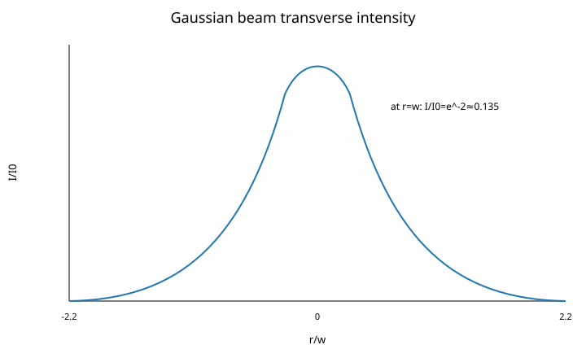

If longitudinal diffraction is enabled, define the Rayleigh range

$$
z_R=\frac{\pi w_0^2}{\lambda},
$$

and

$$
w(z)=w_0\sqrt{1+(z/z_R)^2}.
$$

The saturation parameter is

$$
s(\mathbf r)=\frac{I_{\rm opt}(\mathbf r)}{I_{\rm sat}}.
$$

For the reference $P=10$ mW and $w=8$ mm beams,

$$
I_0\approx99.47\ \mathrm{W/m^2},
$$

so with $I_{\rm sat}=16.69\ \mathrm{W/m^2}$,

$$
s_0\approx5.96
$$

per beam at its centre.

## 5.2 Polarization and coherence

$\sigma^+$ and $\sigma^-$ are not global beam labels; they are defined relative to a quantization axis. The code stores a complex Jones/polarization vector and decomposes it into spherical fractions

$$
P_{-1}+P_0+P_{+1}=1.
$$

It also distinguishes independent beams from coherent beam groups. Within one coherent group fields are summed before taking intensity. Between incoherent groups observables are phase averaged.

**Why this decision?** Treating all six physical beams as one perfectly phase-stable optical field can create interference features that a real apparatus does not possess. Conversely, discarding phase within a genuine retroreflected pair can remove real polarization-gradient physics.

### Actual apparatus sensitivity

For the reference effective model, changing one $x$-beam power by $\pm10\%$ shifts the solved MOT centre by roughly

$$
-0.74\ \mathrm{mm}\quad\text{to}\quad+0.69\ \mathrm{mm},
$$

and a 5-mrad pointing perturbation produces about

$$
36\ \mu\mathrm m
$$

of displacement.

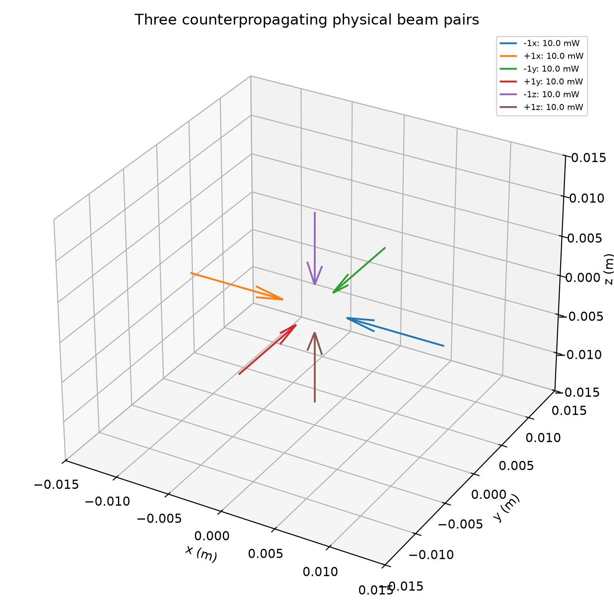

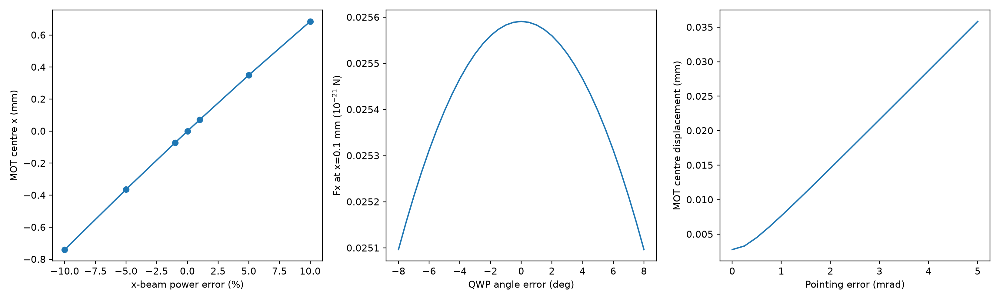

**Why go further?** We now have atom levels, six beams and a magnetic field. We can finally calculate the first MOT force.

---

# 6. First force model: effective semiclassical radiation pressure

## Physical question

Can the chosen laser and quadrupole geometry produce a force that damps velocity and restores position, without yet solving 24 internal states?

For beam $i$, define:

- $\delta_{L,i}$: laser detuning from its reference transition;
- $\delta_{{\rm AOM},i}$: configured frequency/AOM offset;
- $\mathbf k_i$: beam wave vector;
- $\mathbf v$: atomic velocity;
- $-\mathbf k_i\cdot\mathbf v$: Doppler shift;
- $\delta_{Z,i}$: approximate Zeeman shift;
- $s_i$: local saturation parameter.

The effective detuning is

$$
\delta_i
=\delta_{L,i}+\delta_{{\rm AOM},i}
-\mathbf k_i\cdot\mathbf v+\delta_{Z,i}.
$$

If beam $i$ has angular linewidth $\gamma_{L,i}$, the code uses

$$
\Gamma_i^{\rm eff}=\Gamma+\gamma_{L,i}.
$$

The fast scattering model is

$$
R_i=
\frac{\Gamma}{2}
\frac{s_i\,\Gamma/\Gamma_i^{\rm eff}}
{1+\sum_j s_j+\left(2\delta_i/\Gamma_i^{\rm eff}\right)^2}.
$$

The denominator has three pieces: 1 for natural response, $\sum_js_j$ for shared saturation/power broadening, and the Lorentzian detuning factor.

Each absorption event transfers mean momentum $\hbar\mathbf k_i$, so

$$
\mathbf F_{\rm opt}=\sum_i\hbar\mathbf k_iR_i,
$$

and gravity gives

$$
\mathbf F=\mathbf F_{\rm opt}+m\mathbf g.
$$

## 6.1 See Doppler damping before the full 3-D MOT

For two equal red-detuned counterpropagating beams, an atom moving to the right sees the right-opposing beam shifted closer to resonance. The force therefore opposes the velocity near $v=0$.

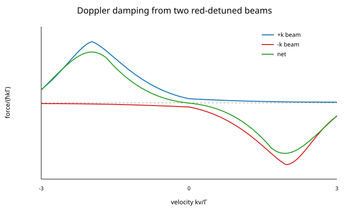

Near zero velocity,

$$
F_x\approx-\beta_vv_x,
$$

with

$$
\beta_v=-\left.\frac{\partial F_x}{\partial v_x}\right|_0.
$$

## 6.2 Add the magnetic gradient: restoring force

A displacement changes the Zeeman shift, so the two counterpropagating beams are no longer equally resonant.

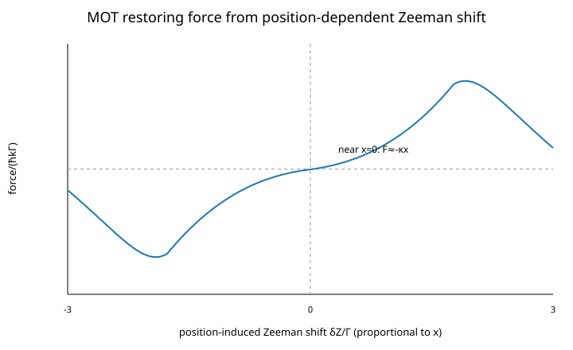

Near the centre,

$$
F_x\approx-\kappa x,
$$

where

$$
\kappa=-\left.\frac{\partial F_x}{\partial x}\right|_0.
$$

Combining the two gives the local damped-spring form

$$
F_x\approx-\kappa x-\beta_vv_x.
$$

### Numerical decision

Evaluate the closed-form scattering force directly and use adaptive RK45 only for the much slower mechanical trajectory. There is no reason to solve a 24-state density matrix at every point of a large capture ensemble if the question is only whether the baseline MOT captures a thermal atom.

### Actual repository result


### Approximation boundary

This model has no explicit repump population, Zeeman-state optical pumping, coherence, dark states or genuine polarization-gradient cooling. The result therefore answers **MOT-scale force and trajectory questions**, not a quantitative sub-Doppler-temperature question.

**Why go further?** Real atoms can be optically pumped into different $m_F$ and even the wrong ground hyperfine manifold. We next retain the full population graph.

---

# 7. Multilevel rate equations: add optical pumping and repump

## Physical question

How are the 24 internal-state populations redistributed by the cooling and repump beams, and how does that alter the radiation-pressure force?

Let:

- $p_g$: population of ground state $g$;
- $p_e$: population of excited state $e$;
- $S_{ge}$: generated relative dipole strength;
- $P_b(q)$: fraction of beam $b$ in spherical polarization $q$;
- $s_b$: local saturation of beam $b$;
- $\delta_{b,ge}$: transition-specific detuning;
- $b_{e\rightarrow g}$: spontaneous branching probability.

The effective transition saturation is

$$
s^{\rm eff}_{b,ge}=s_bS_{ge}P_b(q).
$$

With linewidth $\Gamma_b^{\rm eff}$, the stimulated rate is

$$
W_{b,ge}=
\frac{\Gamma}{2}
\frac{s^{\rm eff}_{b,ge}\,\Gamma/\Gamma_b^{\rm eff}}
{1+(2\delta_{b,ge}/\Gamma_b^{\rm eff})^2}.
$$

Unlike the effective force, there is no extra shared-saturation denominator here. Saturation emerges from finite ground/excited populations and bidirectional stimulated transitions; adding the effective denominator again would double count it.

The populations obey

$$
\dot p_e
=\sum_{g,b}W_{b,ge}(p_g-p_e)-\Gamma p_e,
$$

$$
\dot p_g
=\sum_{e,b}W_{b,ge}(p_e-p_g)
+\Gamma\sum_e b_{e\rightarrow g}p_e.
$$

Equivalently,

$$
\dot{\mathbf p}=A_{\rm rate}\mathbf p.
$$

Here $A_{\rm rate}$ means the **population-rate generator matrix**. It is unrelated to the hyperfine constant $A_{\rm hfs}$ defined earlier. Every column sums to zero, which is the numerical statement of probability conservation.

For a stationary internal state,

$$
A_{\rm rate}\mathbf p_{\rm ss}=0,
\qquad
\sum_i p_i=1.
$$

The force from beam $b$ is

$$
\mathbf F_b
=\hbar\mathbf k_b
\sum_{ge}W_{b,ge}(p_g-p_e).
$$

### Tool decision

Use NumPy linear algebra for the stationary null problem. This is much cheaper than integrating a density matrix and is appropriate when coherences are not part of the physical question.

### Actual result


**Interpretation.** Optical pumping and repumping change both the internal-state distribution and the force. The effective model remains useful for broad apparatus scans, but it cannot answer questions involving coherent dark states or Sisyphus cooling.

**Why go further?** A population vector contains no phase information. Sub-Doppler interference and coherent quantum dynamics require a density matrix.

---

# 8. Optical Bloch equations: introduce quantum coherence

## Physical question

How do we describe not only the probability of being in $|g\rangle$ or $|e\rangle$, but also the **phase coherence** between the states?

For a two-level atom the density matrix is

$$
\rho=
\begin{pmatrix}
\rho_{gg}&\rho_{ge}\\
\rho_{eg}&\rho_{ee}
\end{pmatrix}.
$$

The diagonal elements are populations. The off-diagonal elements $\rho_{ge}$ and $\rho_{eg}$ are optical coherences; a population-only rate equation has no place to store them.

## 8.1 Coherent laser interaction

In the rotating frame the repository uses

$$
\frac{H}{\hbar}=
\begin{pmatrix}
0&\Omega^*/2\\
\Omega/2&-\delta
\end{pmatrix}.
$$

Here:

- $H$ is the two-state Hamiltonian;
- $\Omega$ is the complex **Rabi frequency**, which sets the coherent laser-coupling strength;
- $\delta$ is the laser detuning;
- $*$ denotes complex conjugation.

If the system were perfectly closed, its density matrix would obey

$$
\dot\rho=-\frac{i}{\hbar}[H,\rho],
$$

where

$$
[H,\rho]=H\rho-\rho H
$$

is the commutator.

But an excited atom emits photons into unobserved vacuum modes, so a closed-system Schrödinger equation is insufficient.

## 8.2 Why the Lindblad equation is used

Spontaneous decay $|e\rangle\rightarrow|g\rangle$ is represented by the collapse operator

$$
C=\sqrt{\Gamma}\,|g\rangle\langle e|.
$$

For any collapse operator define

$$
\mathcal D[C]\rho
=C\rho C^\dagger
-\frac12\left(C^\dagger C\rho+\rho C^\dagger C\right).
$$

The open-system equation actually solved is therefore

$$
\boxed{
\dot\rho
=-\frac{i}{\hbar}[H,\rho]
+\mathcal D[C]\rho
}.
$$

This form is chosen because it preserves the trace of $\rho$ and represents completely positive Markovian decay.

### First check: laser off

With $\Omega=0$ and the atom initially excited,

$$
\rho_{ee}(t)=e^{-\Gamma t},
$$

$$
\rho_{gg}(t)=1-e^{-\Gamma t}.
$$

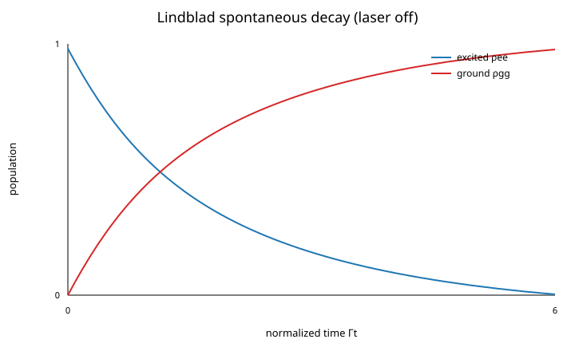

### Second check: laser on — Rabi oscillations

A coherent resonant drive transfers population back and forth between the two states, while spontaneous decay damps the oscillation.

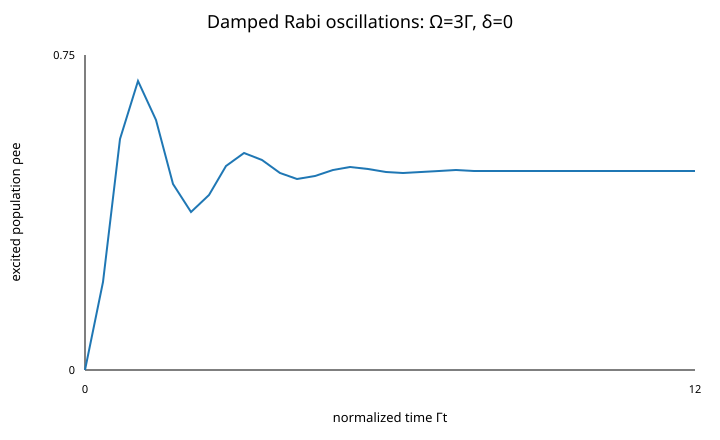

## 8.3 Steady-state OBE result

Define the two-level saturation convention

$$
s=\frac{2|\Omega|^2}{\Gamma^2}.
$$

With no additional pure dephasing, the stationary excited population is

$$
\rho_{ee}
=\frac{s/2}{1+s+(2\delta/\Gamma)^2}.
$$

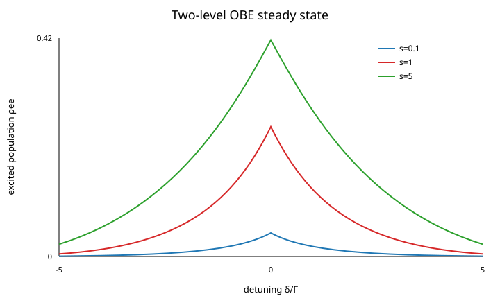

A travelling wave then gives the familiar mean force

$$
\mathbf F=\hbar\mathbf k\,\Gamma\rho_{ee}.
$$

Optional pure dephasing is introduced with

$$
C_\phi=\sqrt{\gamma_\phi/2}\,\sigma_z,
$$

which makes the transverse coherence decay at

$$
\gamma_\perp=\frac\Gamma2+\gamma_\phi.
$$

The repository also contains the corresponding general analytical $\rho_{ee}$; see the equation inventory for the full expression.

## 8.4 Numerical and validation decisions

- **SciPy `solve_ivp`** integrates time-dependent density matrices because the problem is a system of coupled ODEs with controllable tolerances.
- **NumPy linear algebra** solves stationary Liouvillian null problems.
- **QuTiP** is used as an independent open-quantum-system implementation. We compare through QuTiP's public API rather than copying its source.
- **PyLCP** is used independently for a matched laser-cooling force benchmark.

### Validation result

The maximum two-level steady-state population difference from QuTiP is approximately

$$
5.55\times10^{-17},
$$

and the matched normalized two-beam force differs from PyLCP by at most roughly

$$
7.9\times10^{-15}
$$

relative in the tested grid.

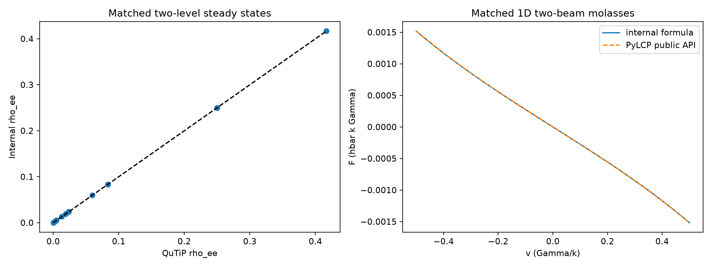

**Interpretation.** The two-level Hamiltonian, detuning, Rabi-frequency, collapse-operator and force conventions agree with independent software essentially at numerical precision. That validates the foundation but does not automatically validate the much larger 24-state calculation.

---

# 9. Extend the OBE to all 24 $^{87}$Rb D2 states

## Physical question

Can we retain coherences, the real hyperfine graph, cooling and repump lasers, vector Zeeman mixing and a moving atom in one model?

The density matrix now has $24\times24$ components and obeys structurally the same master equation,

$$
\dot\rho=-i[h(t),\rho]+\sum_c\mathcal D[C_c]\rho,
$$

where

$$
h=H/\hbar
$$

is stored in angular-frequency units and the $C_c$ operators are generated from the spontaneous branching matrix.

For one internal-state solve, the atom follows

$$
\mathbf r(t)=\mathbf r_0+\mathbf vt.
$$

Beam $i$ carries phase

$$
\phi_i(t)
=\mathbf k_i\cdot(\mathbf r_0+\mathbf vt)
-\delta\omega_i t+\phi_{i,0}.
$$

Here $\delta\omega_i$ contains the residual frequency offset after the chosen rotating frame, and $\mathbf k_i\cdot\mathbf v$ gives the individual beam's Doppler shift.

## 9.1 Why a block-rotating frame was a necessary decision

Cooling and repump carriers differ by several GHz. Explicitly following their carrier beat would require sub-nanosecond resolution even when the physics of interest evolves on microsecond-to-millisecond scales.

The solver therefore uses:

- one common excited-manifold reference;
- one carrier rotation for the $F=1$ ground block;
- another carrier rotation for the $F=2$ ground block.

The large cooling-repump beat is removed analytically, while residual same-manifold AOM/frequency/Doppler beats remain explicit.

This is not merely a speed trick. It is a controlled change of rotating frame that removes dynamics known to be far outside the timescale of interest.

## 9.2 Explicit RWA diagnostic

A laser assigned to one ground hyperfine manifold does not explicitly drive the other ground manifold. The code quantifies the largest discarded amplitude by

$$
\epsilon_{\rm RWA}=\frac{\Omega_{\max}}{\Delta_{\min}},
$$

where $\Omega_{\max}$ is the largest configured Rabi frequency and $\Delta_{\min}$ is the smallest actual detuning to a discarded transition. A population-scale estimate is

$$
P_{\rm discarded}\sim\epsilon_{\rm RWA}^2.
$$

For the reference MOT the stored diagnostics give approximately

$$
\epsilon_{\rm RWA}\approx1.65\times10^{-3},
$$

$$
P_{\rm discarded}\lesssim2.72\times10^{-6}.
$$

Cross-$F$ magnetic terms are also secularly discarded in this rotating frame; that approximation is appropriate for weak MOT fields compared with the 6.835-GHz ground splitting and must be revisited toward the hyperfine Paschen-Back regime.

## 9.3 Force from the Hamiltonian, not from a guessed scattering count

For beam $i$ the coherent force is

$$
\mathbf F_i
=-\hbar\,\mathrm{Tr}
\left[
\rho\,\nabla\left(\frac{H_i}{\hbar}\right)
\right].
$$

This is the negative gradient of the interaction-energy expectation value. The analytic field gradient contains the travelling-wave term $i\mathbf k_i$ and the Gaussian-envelope term $-2\mathbf r_\perp/w^2$, so coherent/dipole-force contributions are retained when the model supports them.

## 9.4 Incoherent beams

If several beam groups are physically incoherent, one arbitrary relative phase is not an observable. The code therefore performs deterministic phase cycling and refines the number of phase realizations until the averaged observable converges. Relative phase is preserved inside a genuinely coherent group.

### Current status

The 24-state solver is implemented and extensively internally tested. The complete multilevel $^{87}$Rb force/population result is **not yet externally matched against a full PyLCP $^{87}$Rb calculation**, so the repository labels that external validation gate honestly as pending.

---

# 10. Why Doppler cooling is not enough: polarization-gradient cooling

## Physical question

How can a multilevel alkali atom cool below the Doppler scale $T_D$?

The essential ingredient is that the local polarization changes in space, producing state-dependent light shifts and optical pumping. An atom can repeatedly climb an optical potential and then be pumped into a lower-energy internal state near the top: the Sisyphus picture.

A coherent beam contributes schematically

$$
\mathbf E_b(\mathbf r)
\propto
\sqrt{s_b}\,\boldsymbol\epsilon_b
\exp[i(\mathbf k_b\cdot\mathbf r+\phi_b)].
$$

Here $s_b$ is beam saturation, $\boldsymbol\epsilon_b$ its complex polarization, $\mathbf k_b$ its wave vector and $\phi_b$ its phase.

After decomposing the local field into $q=-1,0,+1$ components, the reduced low-saturation model gives ground-state $m$ a light shift

$$
U_m(\mathbf r)
=\sum_q
\frac{
\hbar\,\delta_{mq}\Gamma^2C_{mq}^2s_q(\mathbf r)
}{
8[\delta_{mq}^2+(\Gamma/2)^2]
},
$$

where $C_{mq}^2$ is the transition strength and $\delta_{mq}$ is the transition-specific detuning.

The corresponding optical-pumping rate is

$$
R_{mq}(\mathbf r)
=\frac{
\Gamma^3C_{mq}^2s_q(\mathbf r)
}{
8[\delta_{mq}^2+(\Gamma/2)^2]
}.
$$

The five $F=2$ ground populations obey

$$
\dot{\mathbf p}=A_{\rm pump}[\mathbf r(t)]\mathbf p,
$$

and the state-resolved conservative force is

$$
\mathbf F_m=-\nabla U_m.
$$

The mean force is

$$
\mathbf F=\sum_mp_m\mathbf F_m.
$$

### Why retain this reduced model if a 24-state OBE exists?

Because it makes the Sisyphus mechanism inspectable. One can see the polarization lattice, light shifts, pumping and force separately. It is much cheaper than a full moving OBE and therefore useful pedagogically and for controlled scans.

### Approximation

It retains populations but not ground-state coherences. It cannot reproduce Raman dark states or a complete coherent magnetic-field response, and its diffusion model is incomplete.

### Actual result


The committed reference uses

$$
\Delta=-3\Gamma,
\qquad
s=0.08\ \text{per beam}.
$$

**Why go further?** A residual magnetic field acts on coherences and can mix states transversely. The population model therefore explicitly refuses a generic transverse field and directs that calculation to the vector OBE.

---

# 11. Residual magnetic field during PGC

The characteristic Larmor precession rate is

$$
\omega_L=|g_F|\frac{\mu_BB}{\hbar}.
$$

For the $F=2$ $^{87}$Rb ground manifold, the repository obtains approximately

$$
\frac{\omega_L}{2\pi}\approx699.6\ \mathrm{Hz/mG}.
$$

For the particular low-intensity $\Delta=-3\Gamma$, $s=0.08$/beam reference, a simple weak-drive optical-pumping scale is about

$$
R_{\rm pump}\approx6.56\ \mathrm{kHz}.
$$

The two rates become comparable near

$$
B\approx9.4\ \mathrm{mG}.
$$

### What does 9.4 mG mean?

It means magnetic precession is becoming competitive with the optical-pumping dynamics that build the sub-Doppler internal-state distribution. It is a **timescale marker**.

It is **not** a calculated 10% temperature threshold and not a universal compensation requirement.

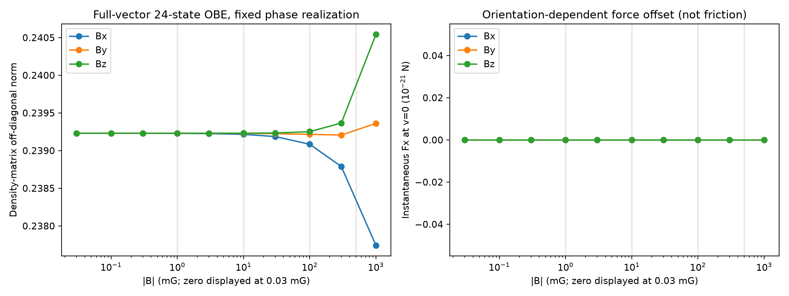

A defensible temperature curve would require a converged friction coefficient

$$
\beta_v(B)
=-\left.\frac{\partial F}{\partial v}\right|_{v=0}
$$

and a momentum-diffusion model at the **same physical fidelity**. Because internal-state switching and dipole-force fluctuations are not yet fully included in the matched diffusion calculation, the repository deliberately does not manufacture a quantitative $T(B)$ from inconsistent models.

This is a modelling decision, not a missing algebra step.

---

# 12. Turn force into an atomic trajectory

Once a force model has been chosen, centre-of-mass motion is treated semiclassically:

$$
\dot{\mathbf r}=\mathbf v,
$$

$$
m\dot{\mathbf v}=\mathbf F(\mathbf r,\mathbf v,t).
$$

### Why classical motion?

The MOT beam and cloud length scales are large compared with the motional de Broglie wavelength for the thermal atoms being captured. A full motional wavefunction would be vastly more expensive and unnecessary for the capture/trajectory questions addressed here.

### Numerical decision

Use SciPy adaptive RK45 with explicit tolerances and maximum step. The solver refines its internal step automatically where the force changes rapidly.


## Photon recoil

For a photon absorbed from beam $i$,

$$
\Delta\mathbf p_{\rm abs}=+\hbar\mathbf k_i.
$$

Spontaneous emission is sampled isotropically in the present stochastic model. Its mean recoil is zero, while each Cartesian component has variance

$$
\left\langle\Delta p_j^2\right\rangle=\frac{(\hbar k)^2}{3}.
$$

The Bernoulli event time step is restricted so that

$$
R_{\rm tot}\Delta t\lesssim0.1,
$$

reducing the probability that multiple unrepresented scattering events occur within one step.

**Boundary.** A short stochastic trajectory includes recoil heating, but it is not automatically an equilibrium-temperature calculation.

---

# 13. Make the experiment time dependent

A real sequence changes laser and magnetic parameters with time:

**MOT loading → compressed MOT → gradient switch-off → field settling → PGC ramp → molasses hold → release/TOF.**

For a stage fraction $0\le f\le1$, a linear ramp is

$$
y(f)=y_0+(y_1-y_0)f.
$$

A smoothstep uses

$$
s(f)=f^2(3-2f)
$$

instead of $f$, giving zero slope at both endpoints.

After quadrupole switch-off, a simple coil-gradient response is

$$
G(t)=G_0e^{-(t-t_{\rm off})/\tau_{\rm coil}},
$$

while a residual field can contain

$$
\mathbf B(t)
=\mathbf B_{\rm DC}
+\mathbf B_{\rm eddy}e^{-(t-t_{\rm off})/\tau_{\rm eddy}}
+\mathbf B_{\rm AC}\sin(2\pi ft+\phi).
$$

Every symbol is an input: $G_0$ is the starting gradient, $t_{\rm off}$ switch time, $\tau$ values are decay time constants, and the DC/eddy/AC amplitudes are vector fields.

**Decision.** The simulator never invents a laboratory 50/60-Hz noise amplitude. It remains zero unless supplied or measured.

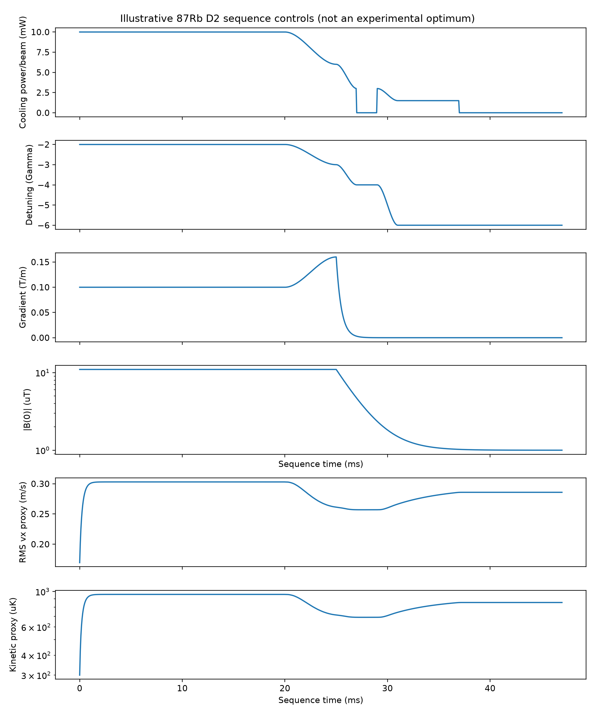

The stored timing study is a reproducible illustrative scenario, not a fitted experimental optimum.

---

# 14. Where do vapour-cell atoms come from?

## 14.1 Vapour pressure and density

When a rubidium partial pressure is not supplied directly, the stored natural-Rb fit is

$$
\log_{10}P[\mathrm{Pa}]
=7.738-\frac{4215}{T}
$$

for the solid branch and

$$
\log_{10}P[\mathrm{Pa}]
=7.193-\frac{4040}{T}
$$

for the liquid branch in its documented range.

Here $T$ is temperature in kelvin and $P$ pressure in pascal. The ideal-gas number density is

$$
n=\frac{P}{k_BT}.
$$

The code intentionally allows reservoir/cold-spot temperature, vapour kinetic temperature and background-gas temperature to differ because they control different pieces of the calculation.

## 14.2 Why the ordinary Maxwell speed distribution is wrong at a surface

For an equilibrium gas, the number crossing unit area of a surface per unit time is

$$
\frac{\Phi}{A_s}
=n\sqrt{\frac{k_BT}{2\pi m}}
=\frac{n\langle v\rangle}{4},
$$

where $A_s$ is surface area and $\Phi$ is particle flux.

Define

$$
a=\frac{m}{2k_BT}.
$$

The normalized **surface-crossing** speed distribution is

$$
p_{\rm flux}(v)=2a^2v^3e^{-av^2}.
$$

It has one additional factor of $v$ compared with the ordinary bulk Maxwell speed distribution because faster atoms cross a surface more frequently.

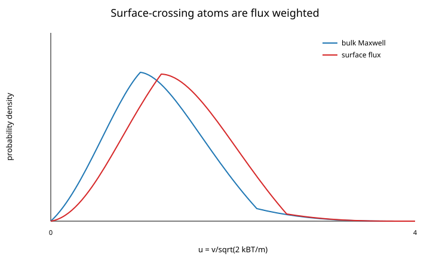

Incidence direction follows the cosine law. With $\mu=\cos\theta$,

$$
p(\mu)=2\mu,
\qquad0\le\mu\le1.
$$

**Why this matters.** MOT capture samples the rare slow tail. Using the wrong thermal distribution would systematically bias the predicted loading rate.

---

# 15. Define capture and calculate the loading rate

A trajectory is labelled captured only if it remains inside a specified acceptance radius and below a specified speed continuously for at least a dwell time.

That criterion is an explicit **numerical definition of acceptance**. The sphere is not claimed to be the actual vacuum-cell wall.

Let:

- $\Phi_{\rm incident}$ be the isotope-specific flux crossing the acceptance surface;
- $P_{\rm capture}$ be the trajectory-derived probability of satisfying the capture criterion.

Then

$$
R_{\rm load}
=\Phi_{\rm incident}P_{\rm capture}.
$$

## Why stratified Monte Carlo?

Capturable thermal atoms lie in an extremely rare slow tail. An unstratified sample can easily observe zero captures and misleadingly suggest an exact zero probability.

The code therefore samples speed strata with their exact thermal weights and uses Wilson confidence intervals. A final zero-capture high-speed bin is used only to place an upper bound on unresolved loading; it is never treated as proof that faster atoms have exactly zero capture probability.

The code also constructs

$$
P_{\rm capture}(v,b),
$$

where $b$ is impact parameter.


---

# 16. Convert loading into atom number

## 16.1 One-body loss

Let:

- $N(t)$ be trapped atom number;
- $R_{\rm load}$ be the loading rate;
- $\gamma$ be the total one-body loss rate.

Then

$$
\dot N=R_{\rm load}-\gamma N.
$$

Its solution is

$$
N(t)=N_{\rm ss}+(N_0-N_{\rm ss})e^{-\gamma t},
$$

where

$$
N_{\rm ss}=\frac{R_{\rm load}}{\gamma}.
$$

## 16.2 Why two-body loss is proportional to $n^2$

A binary collision requires two atoms to be present at the same place, so the event rate is proportional to the product of two densities. Let $\beta_2$ be the two-body loss coefficient. Then

$$
\dot N
=R_{\rm load}-\gamma N-\beta_2\int n^2(\mathbf r)dV.
$$

For a Gaussian cloud with RMS widths $\sigma_x,\sigma_y,\sigma_z$,

$$
n(\mathbf r)
=\frac{N}{(2\pi)^{3/2}\sigma_x\sigma_y\sigma_z}
\exp\left[-\frac12\left(
\frac{x^2}{\sigma_x^2}+
\frac{y^2}{\sigma_y^2}+
\frac{z^2}{\sigma_z^2}
\right)\right].
$$

Squaring and integrating gives

$$
\int n^2dV
=\frac{N^2}{8\pi^{3/2}\sigma_x\sigma_y\sigma_z}.
$$

Define the effective two-body volume

$$
V_{2,\rm eff}
=8\pi^{3/2}\sigma_x\sigma_y\sigma_z.
$$

Then the loading equation becomes

$$
\boxed{
\dot N
=R_{\rm load}-\gamma N-rac{\beta_2}{V_{2,\rm eff}}N^2
}.
$$

The positive steady state is

$$
N_{\rm ss}
=
\frac{2R_{\rm load}}
{\gamma+\sqrt{\gamma^2+4(\beta_2/V_{2,\rm eff})R_{\rm load}}}.
$$

### Equation picture

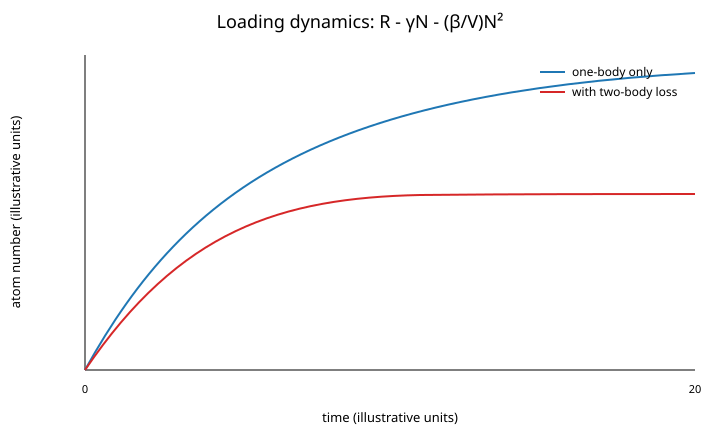

### Repository result


**Scientific decision.** The code does not invent $\gamma$, collision cross sections or $\beta_2$. They must be supplied from measurement, calibration or literature. Therefore a trajectory-derived loading rate is a calculated result, whereas the absolute atom-number curve remains scenario dependent until the loss inputs are experimentally grounded.

---

# 17. When does the independent-atom picture fail?

At large $N$, the cloud can attenuate the trapping beams and reabsorb scattered photons. The optional collective model therefore represents the cloud as a Gaussian continuum rather than simulating $N$ atoms individually.

The Gaussian peak density is

$$
n_0
=\frac{N}{(2\pi)^{3/2}\sigma_x\sigma_y\sigma_z}.
$$

A central optical depth is schematically

$$
OD=\sigma_{\rm opt}\,\mathcal N,
$$

where $\sigma_{\rm opt}$ is an effective optical cross section and $\mathcal N$ is column density.

A Walker/Sesko/Wieman-style mean-field coefficient is

$$
Q
=\frac{\sigma_L\sigma_RI_{\rm tot}}{4\pi c},
$$

where $\sigma_L$ and $\sigma_R$ are effective laser-scattering and reabsorption cross sections and $I_{\rm tot}$ is total laser intensity.

The repulsive force is approximated by

$$
F_{\rm rep}(r)
=Q\frac{N_{\rm enclosed}(r)}{r^2}.
$$

A simple reabsorption probability proxy is

$$
P_{\rm reabs}=1-e^{-OD_R}.
$$

Balancing a linear restoring force with the mean-field repulsion gives a density scale

$$
n_{\rm lim}=\frac{3\kappa}{4\pi Q}.
$$

### Actual collective result

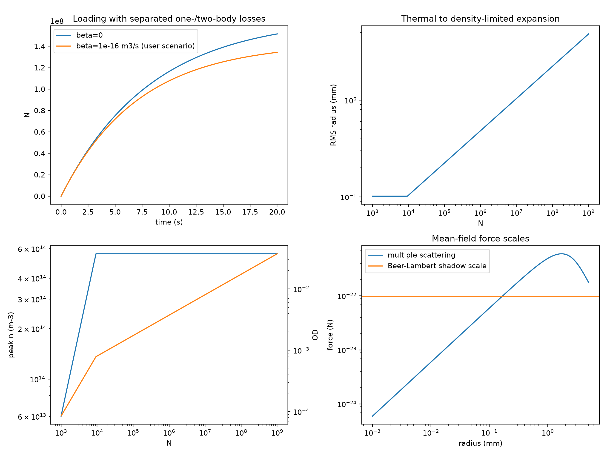

**Approximation.** This is not full radiative transfer. It omits detailed frequency redistribution, repeated scattering, polarization-dependent transport, anisotropic escape and arbitrary cloud deformation. It is a trend-level density/expansion model.

---

# 18. What has actually been independently validated?

A complex code is not validated merely because all of its internal unit tests pass. The repository therefore separates three concepts:

- **implemented**: the code exists and passes internal consistency/convergence tests;
- **externally verified**: a matched calculation agrees with independent software;
- **experimentally calibrated**: measured apparatus inputs and a quantitative experimental comparison support the prediction.

The strongest current external checks are:

### Two-level OBE versus QuTiP

Maximum absolute steady-state excited-population difference:

$$
5.55\times10^{-17}.
$$

### Normalized two-beam force versus PyLCP

Maximum relative force difference:

$$
7.93\times10^{-15}.
$$

### $^{87}$Rb ground vector-Zeeman spectrum versus PyLCP

Maximum spectral difference over the tested fields:

$$
\approx0.57\ \mathrm{Hz}.
$$


The full 24-state moving OBE force and a quantitative OBE-consistent PGC temperature remain external-validation targets.

---

# 19. The complete calculation in one chain

The repo's physics can now be read as one connected calculation:

1. Atomic constants give $\lambda$, $m$, $\tau$, $A_{\rm hfs}$ and $B_{\rm hfs}$.
2. Hyperfine equations generate $F,m_F$ levels and transition frequencies.
3. Wigner 6-j and Clebsch-Gordan algebra generate optical strengths and spontaneous branching.
4. Six beam objects generate $I(\mathbf r)$, $s(\mathbf r)$, $\mathbf k$ and polarization components.
5. Quadrupole/coils generate $\mathbf B(\mathbf r,t)$.
6. Choose the least expensive internal-state model that can answer the question: effective force, rate equations, or OBE.
7. Calculate $\mathbf F(\mathbf r,\mathbf v,t)$.
8. Integrate $\dot{\mathbf r}=\mathbf v$, $m\dot{\mathbf v}=\mathbf F$.
9. For vapour loading, sample the correct flux-weighted incident ensemble and classify capture.
10. Compute $R_{\rm load}=\Phi P_{\rm capture}$.
11. Integrate $\dot N=R_{\rm load}-\gamma N-(\beta_2/V)N^2$.
12. Add sequence timing, magnetic transients and collective effects only when the physical question requires them.

The final rule is as important as the equations:

> **Do not promote an observable beyond the fidelity of the model that generated it.**

A force curve is not automatically a temperature. A calculated capture probability is not automatically a calibrated atom number. A static coherence change is not automatically a residual-field temperature tolerance.

---

# 20. How to reproduce the work

From a clean checkout:

```bash
git clone https://github.com/kavishbhardwaj/cold-atom-simulations.git
cd cold-atom-simulations
python -m venv .venv
source .venv/bin/activate        # Linux/macOS
# .venv\Scripts\Activate.ps1    # Windows PowerShell
python -m pip install --upgrade pip
python -m pip install -r requirements-dev.txt
```

Core solver paths:

```bash
python -m cold_atom_mot simulate configs/rb87_d2_mot.yaml
python -m cold_atom_mot rate-equation configs/rb87_d2_multilevel.yaml
python -m cold_atom_mot obe configs/rb87_d2_two_level_obe.yaml
python -m cold_atom_mot subdoppler configs/rb87_d2_polarization_gradient.yaml
python -m cold_atom_mot loading configs/rb_vapor_loading.yaml
```

Representative result generators:

```bash
python examples/generate_vector_zeeman_results.py
python examples/generate_six_beam_apparatus_results.py
python examples/generate_magnetic_apparatus_results.py
python examples/generate_sequence_results.py
python examples/generate_capture_loading_results.py
python examples/generate_collective_mot_results.py
```

Independent validation:

```bash
python -m pip install -r requirements-validation.txt
python examples/generate_external_validation_results.py
```

Regression checks:

```bash
python -m pytest -q
python -m compileall src tests examples
git diff --check
```

A scientific reproduction should also record the commit SHA, configuration file, package versions, random seed, integration tolerances, maximum step, phase-sampling settings and stochastic ensemble size.

---

# 21. Where to go next

If a formula in this walkthrough still introduces an unfamiliar symbol, check the [complete notation/equation inventory](00_notation_and_equation_inventory.md). It explicitly distinguishes symbols such as $A_{\rm hfs}$, $A_{\rm rate}$, nuclear spin $I$, optical intensity $I_{\rm opt}$, coil current $I_c$, damping $\beta_v$, and two-body loss $\beta_2$.

If you want to understand an equation visually before reading its implementation, use the [equation visual atlas](equation_visual_atlas.md).

If you want implementation details, the original chaptered references remain available from the [tutorial index](README.md) and the broader [documentation map](../README.md).
