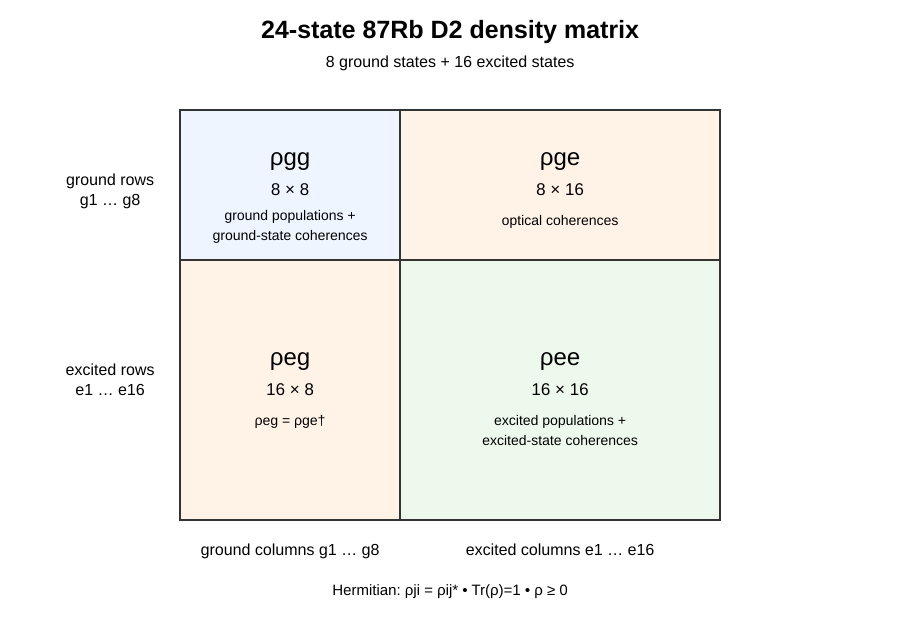
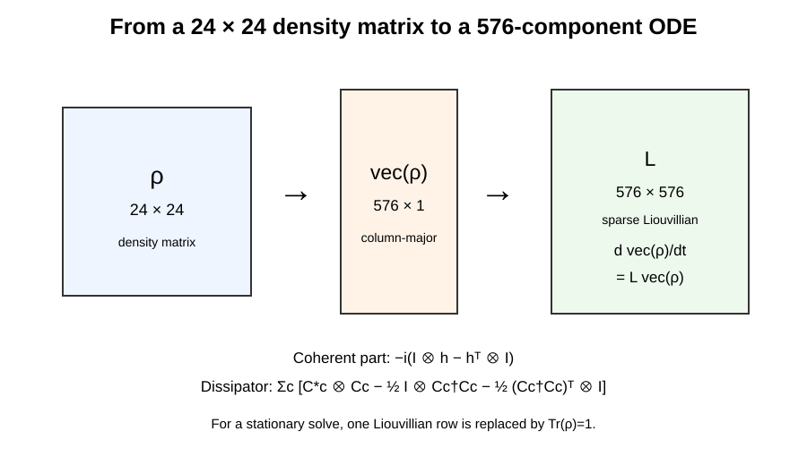

# From One Rubidium Atom to a Magneto-Optical Trap
## A full worked derivation of the `cold-atom-simulations` model

This is the most detailed learning document in the repository. It is written like a textbook derivation rather than software documentation.

The goal is to show **how the calculation is built**, in the same order that one could reproduce it by hand and then in code:

1. choose the atom and define its energy scales;
2. construct the hyperfine basis;
3. generate all allowed optical transitions;
4. add magnetic fields;
5. construct the six laser beams;
6. derive the effective MOT force;
7. upgrade to multilevel rate equations;
8. construct the full $24\times24$ density matrix;
9. build the full multilevel Hamiltonian and all Lindblad collapse operators;
10. vectorize the density matrix into a 576-component state;
11. construct the $576\times576$ sparse Liouvillian;
12. solve for stationary or time-dependent internal dynamics;
13. derive the quantum force operator;
14. propagate atomic motion;
15. add polarization-gradient cooling;
16. add vapour loading and losses;
17. add optional collective-MOT physics;
18. validate each level against analytical results, QuTiP, PyLCP, or experiment.

Every symbol is defined before it is used. Every approximation is stated where it enters.

> **Scope.** This repository is independent after-hours work developed from personal scientific interest and kept as a reproducible record and backup. Laboratory control, acquisition, and other lab codes are not kept here.

---

# 1. The quantity we ultimately want: force

A MOT works because the optical force depends on both position and velocity.

Near the trap centre, a useful local form is

$$
F_x(x,v_x)\approx-\kappa x-\beta_v v_x.
$$

Here:

- $x$ is displacement from the trap centre;
- $v_x$ is velocity;
- $\kappa$ is the local restoring or spring coefficient;
- $\beta_v$ is the local velocity-damping coefficient.

The signs required for stable cooling/trapping are

$$
\kappa>0,
\qquad
\beta_v>0.
$$

The code does not assume this force globally. It calculates the full nonlinear force and then evaluates

$$
\kappa
=-\left.\frac{\partial F_x}{\partial x}\right|_{x=0,v=0},
$$

$$
\beta_v
=-\left.\frac{\partial F_x}{\partial v_x}\right|_{x=0,v=0}.
$$

To calculate $F$, we first need the atom.

---

# 2. Reference atom: $^{87}$Rb D2

The main reference transition is

$$
^{87}\mathrm{Rb}:\qquad
5S_{1/2}\rightarrow5P_{3/2},
$$

with

$$
\lambda=780.241209686\ \mathrm{nm}.
$$

The optical wave number is

$$
k=\frac{2\pi}{\lambda}.
$$

The excited-state lifetime is

$$
\tau=26.2348\ \mathrm{ns},
$$

so the spontaneous population-decay rate is

$$
\Gamma=\frac1\tau
\approx3.8117\times10^7\ \mathrm{s^{-1}}.
$$

It is often quoted spectroscopically as

$$
\frac{\Gamma}{2\pi}\approx6.0666\ \mathrm{MHz}.
$$

The two-level Doppler-temperature scale is

$$
T_D=\frac{\hbar\Gamma}{2k_B}
\approx145.6\ \mu\mathrm K.
$$

The recoil velocity is

$$
v_r=\frac{\hbar k}{m}
\approx5.88\ \mathrm{mm/s},
$$

and the one-photon recoil temperature is

$$
T_r=\frac{(\hbar k)^2}{2mk_B}
\approx0.181\ \mu\mathrm K.
$$

These scales immediately provide a useful physical check: a $50\ \mu$K sample is below the Doppler limit but is still hundreds of recoil temperatures above the recoil scale.

---

# 3. Hyperfine structure

## 3.1 Angular momenta

For one fine-structure manifold, define:

- $I$: nuclear spin;
- $J$: total electronic angular momentum;
- $F$: total hyperfine angular momentum;
- $m_F$: projection of $F$ on a fixed laboratory quantization axis.

They satisfy

$$
\mathbf F=\mathbf I+\mathbf J.
$$

For $^{87}$Rb,

$$
I=\frac32.
$$

Allowed hyperfine angular momenta are

$$
F=|I-J|,|I-J|+1,\ldots,I+J.
$$

Therefore:

$$
5S_{1/2}:\quad J=\frac12\Rightarrow F=1,2,
$$

and

$$
5P_{3/2}:\quad J=\frac32\Rightarrow F'=0,1,2,3.
$$

## 3.2 Why the quantity $K$ appears

Angular-momentum addition gives

$$
\mathbf F^2
=(\mathbf I+\mathbf J)^2
=\mathbf I^2+\mathbf J^2+2\mathbf I\cdot\mathbf J.
$$

Hence

$$
\mathbf I\cdot\mathbf J
=\frac12\left[F(F+1)-I(I+1)-J(J+1)\right].
$$

Define

$$
K\equiv F(F+1)-I(I+1)-J(J+1).
$$

Then

$$
\mathbf I\cdot\mathbf J=\frac K2.
$$

## 3.3 Magnetic-dipole hyperfine constant $A_{\rm hfs}$

$A_{\rm hfs}$ is the measured magnetic-dipole hyperfine constant. The corresponding energy contribution is

$$
\frac{E_A}{h}=\frac{A_{\rm hfs}}2K.
$$

For the $^{87}$Rb $5S_{1/2}$ ground state,

$$
A_{\rm hfs}=3.417341305452145\ \mathrm{GHz}.
$$

For $F=2$,

$$
K_2=1.5,
$$

and for $F=1$,

$$
K_1=-2.5.
$$

Therefore

$$
\frac{E_{F=2}-E_{F=1}}h
=\frac{A_{\rm hfs}}2(K_2-K_1)
=2A_{\rm hfs}
\approx6.83468\ \mathrm{GHz}.
$$

This is the ground-state hyperfine separation that later makes the cooling and repump optical carriers differ by several GHz.

## 3.4 Electric-quadrupole hyperfine constant $B_{\rm hfs}$

$B_{\rm hfs}$ is the electric-quadrupole hyperfine constant. It must not be confused with the magnetic field vector $\mathbf B$.

When both $I\ge1$ and $J\ge1$, the full hyperfine energy used by the repository is

$$
\boxed{
\frac{E_{\rm hfs}}h
=
\frac{A_{\rm hfs}}2K
+B_{\rm hfs}
\frac{\frac34K(K+1)-I(I+1)J(J+1)}
{2I(2I-1)J(2J-1)}
}.
$$

For $5S_{1/2}$, $J=1/2$, so the rank-two quadrupole term is absent. For $5P_{3/2}$ it is retained.

---

# 4. The exact 24-state $^{87}$Rb D2 basis used in the code

The code orders states by increasing $F$, then increasing $m_F$.

## 4.1 Ground states

There are eight ground states:

$$
\begin{aligned}
|g_1\rangle&=|1,-1\rangle,\\
|g_2\rangle&=|1,0\rangle,\\
|g_3\rangle&=|1,+1\rangle,\\
|g_4\rangle&=|2,-2\rangle,\\
|g_5\rangle&=|2,-1\rangle,\\
|g_6\rangle&=|2,0\rangle,\\
|g_7\rangle&=|2,+1\rangle,\\
|g_8\rangle&=|2,+2\rangle.
\end{aligned}
$$

Here $|F,m_F\rangle$ is abbreviated as $|F,m\rangle$.

## 4.2 Excited states

There are sixteen excited states:

$$
\begin{aligned}
|e_1\rangle&=|0,0\rangle,\\
|e_2\rangle&=|1,-1\rangle,
&|e_3\rangle&=|1,0\rangle,
&|e_4\rangle&=|1,+1\rangle,\\
|e_5\rangle&=|2,-2\rangle,
&|e_6\rangle&=|2,-1\rangle,
&|e_7\rangle&=|2,0\rangle,\\
|e_8\rangle&=|2,+1\rangle,
&|e_9\rangle&=|2,+2\rangle,\\
|e_{10}\rangle&=|3,-3\rangle,
&|e_{11}\rangle&=|3,-2\rangle,
&|e_{12}\rangle&=|3,-1\rangle,\\
|e_{13}\rangle&=|3,0\rangle,
&|e_{14}\rangle&=|3,+1\rangle,
&|e_{15}\rangle&=|3,+2\rangle,
&|e_{16}\rangle&=|3,+3\rangle.
\end{aligned}
$$

The full state vector basis is

$$
\mathcal B=
\{|g_1\rangle,\ldots,|g_8\rangle,
|e_1\rangle,\ldots,|e_{16}\rangle\}.
$$

Therefore

$$
N_{\rm states}=24.
$$

---

# 5. Optical selection rules and transition strengths

Electric-dipole hyperfine selection rules are

$$
\Delta F=0,\pm1,
$$

with

$$
F=0\not\leftrightarrow F'=0.
$$

The Zeeman projection rule is

$$
\Delta m_F=q=m_F'-m_F,
$$

where

$$
q\in\{-1,0,+1\}.
$$

These correspond to

$$
q=-1\Rightarrow\sigma^-,
\qquad
q=0\Rightarrow\pi,
\qquad
q=+1\Rightarrow\sigma^+.
$$

The relative hyperfine reduced strength is

$$
S_{F\rightarrow F'}
\propto
(2F'+1)(2J_g+1)
\begin{Bmatrix}
J_e&F'&I\\
F&J_g&1
\end{Bmatrix}^2.
$$

The Zeeman-resolved strength is

$$
S_{Fm\rightarrow F'm'}
\propto
S_{F\rightarrow F'}
\left|
\langle F,m;1,q|F',m'\rangle
\right|^2.
$$

The repository generates these factors with SymPy Wigner-6j and Clebsch-Gordan routines, then normalizes the strongest transition to unit relative strength.

For spontaneous decay from an excited state $e$ to ground state $g$,

$$
b_{e\rightarrow g}
=\frac{S_{ge}}
{\sum_{g'}S_{g'e}},
$$

so

$$
\sum_gb_{e\rightarrow g}=1.
$$

The same generated transition graph is therefore used for both laser coupling and spontaneous branching.

---

# 6. Magnetic field and Zeeman Hamiltonian

## 6.1 Ideal quadrupole field

The fast MOT field is

$$
\mathbf B(\mathbf r)
=R\,
\mathrm{diag}(b',b',-2b')
R^T(\mathbf r-\mathbf r_0).
$$

Its gradient satisfies

$$
\nabla\cdot\mathbf B=0,
$$

because

$$
\mathrm{Tr}[\nabla\mathbf B]
=b'+b'-2b'=0.
$$

## 6.2 Weak-field hyperfine Zeeman shift

The weak-field Landé factor is

$$
g_F=
\frac{
 g_J[F(F+1)+J(J+1)-I(I+1)]
+g_I[F(F+1)+I(I+1)-J(J+1)]
}
{2F(F+1)}.
$$

Then

$$
\Delta E\approx g_F\mu_Bm_FB.
$$

## 6.3 Exact vector Zeeman Hamiltonian

For arbitrary vector magnetic fields the code uses

$$
\boxed{
H_Z
=\mu_B
\left(g_J\mathbf J+g_I\mathbf I\right)\cdot\mathbf B
}.
$$

The full atomic Hamiltonian within one fine-structure manifold is

$$
H_{\rm atom}=H_{\rm hfs}+H_Z.
$$

The hyperfine Hamiltonian is built in the stable uncoupled basis $|m_I,m_J\rangle$:

$$
\frac{H_{\rm hfs}}h
=A_{\rm hfs}\mathbf I\cdot\mathbf J
+B_{\rm hfs}
\frac{
3(\mathbf I\cdot\mathbf J)^2
+\frac32\mathbf I\cdot\mathbf J
-I(I+1)J(J+1)\mathbf1
}
{2I(2I-1)J(2J-1)}.
$$

The basis transformation is

$$
|F,m_F\rangle
=\sum_{m_I,m_J}
\langle I,m_I;J,m_J|F,m_F\rangle
|m_I,m_J\rangle.
$$

This allows transverse fields to mix fixed laboratory $|F,m_F\rangle$ states rather than redefining the quantization axis at every point.

The tested ground-state spectrum agrees with PyLCP at approximately the sub-hertz level.

---

# 7. Six physical Gaussian beams

For a collimated elliptical Gaussian beam,

$$
I(x,y)
=\frac{2P}{\pi w_xw_y}
\exp\left[-2\left(
\frac{x^2}{w_x^2}
+\frac{y^2}{w_y^2}
\right)\right].
$$

For propagation away from the waist,

$$
w_x(z)=w_{x0}
\sqrt{1+\left(\frac{z}{z_{Rx}}\right)^2},
$$

$$
w_y(z)=w_{y0}
\sqrt{1+\left(\frac{z}{z_{Ry}}\right)^2},
$$

where

$$
z_{Rx}=\frac{\pi w_{x0}^2}{\lambda},
\qquad
z_{Ry}=\frac{\pi w_{y0}^2}{\lambda}.
$$

The saturation parameter is

$$
s_i(\mathbf r)=\frac{I_i(\mathbf r)}{I_{\rm sat}}.
$$

The beam wave vector is

$$
\mathbf k_i=\frac{2\pi}{\lambda}\hat{\mathbf k}_i.
$$

A complex optical field is represented schematically by

$$
\mathbf E_i(\mathbf r)
\propto
\sqrt{I_i(\mathbf r)}
\boldsymbol\epsilon_i
\exp[i\Phi_i(\mathbf r)].
$$

A circular polarization relative to its own propagation direction is

$$
\boldsymbol\epsilon_\pm
=\frac{\mathbf e_1\pm i\mathbf e_2}{\sqrt2}.
$$

Relative to a chosen spherical basis,

$$
P_q
=|\boldsymbol\epsilon_q^\dagger
\boldsymbol\epsilon|^2,
$$

with

$$
P_{-1}+P_0+P_{+1}=1.
$$

---

# 8. Effective semiclassical MOT force

For beam $i$, define the effective detuning

$$
\delta_i
=\delta_{L,i}
+\delta_{{\rm AOM},i}
-\mathbf k_i\cdot\mathbf v
+\delta_{Z,i}.
$$

The Doppler contribution is

$$
\delta_D=-\mathbf k_i\cdot\mathbf v.
$$

If the laser has angular linewidth $\gamma_{L,i}$, define

$$
\Gamma_i^{\rm eff}=\Gamma+\gamma_{L,i}.
$$

The effective scattering rate is

$$
\boxed{
R_i
=\frac{\Gamma}{2}
\frac{s_i\Gamma/\Gamma_i^{\rm eff}}
{1+\sum_js_j+
(2\delta_i/\Gamma_i^{\rm eff})^2}
}.
$$

The optical force is

$$
\boxed{
\mathbf F_{\rm opt}
=\sum_i\hbar\mathbf k_iR_i
}.
$$

Gravity gives

$$
\mathbf F=\mathbf F_{\rm opt}+m\mathbf g.
$$

This is the fast model used for large trajectory and capture calculations. It deliberately omits explicit hyperfine-state populations and coherences.

---

# 9. Multilevel rate equations

For beam $b$ and allowed transition $g\leftrightarrow e$, define

$$
s_{b,ge}^{\rm eff}
=s_bS_{ge}P_b(q).
$$

The stimulated rate is

$$
W_{b,ge}
=\frac{\Gamma}{2}
\frac{s_{b,ge}^{\rm eff}\Gamma/\Gamma_b^{\rm eff}}
{1+(2\delta_{b,ge}/\Gamma_b^{\rm eff})^2}.
$$

For excited population $p_e$,

$$
\dot p_e
=\sum_{g,b}W_{b,ge}(p_g-p_e)
-\Gamma p_e.
$$

For ground population $p_g$,

$$
\dot p_g
=\sum_{e,b}W_{b,ge}(p_e-p_g)
+\Gamma\sum_eb_{e\rightarrow g}p_e.
$$

Write this as

$$
\dot{\mathbf p}=A_{\rm rate}\mathbf p.
$$

The stationary solution obeys

$$
A_{\rm rate}\mathbf p_{\rm ss}=0,
$$

subject to

$$
\sum_ip_i=1.
$$

The force from beam $b$ is

$$
\mathbf F_b
=\hbar\mathbf k_b
\sum_{ge}W_{b,ge}(p_g-p_e).
$$

The rate model adds real optical pumping and repump dynamics but still discards all quantum coherences.

---

# 10. Density matrix: what the full $24\times24$ object actually is

The density matrix stores both populations and coherences.

For the ordered basis

$$
\{|g_1\rangle,\ldots,|g_8\rangle,
|e_1\rangle,\ldots,|e_{16}\rangle\},
$$

define

$$
\rho_{ij}=\langle i|\rho|j\rangle.
$$

The full matrix is

$$
\boxed{
\rho=
\begin{pmatrix}
\rho_{gg}&\rho_{ge}\\
\rho_{eg}&\rho_{ee}
\end{pmatrix}
}.
$$

The block dimensions are

$$
\rho_{gg}:8\times8,
\qquad
\rho_{ge}:8\times16,
$$

$$
\rho_{eg}:16\times8,
\qquad
\rho_{ee}:16\times16.
$$

The interpretation is:

- diagonal entries of $\rho_{gg}$: ground-state populations;
- off-diagonal entries of $\rho_{gg}$: ground-state coherences;
- diagonal entries of $\rho_{ee}$: excited-state populations;
- off-diagonal entries of $\rho_{ee}$: excited-state coherences;
- $\rho_{ge}$ and $\rho_{eg}$: optical coherences between ground and excited states.

Examples:

$$
\rho_{44}
=P(F=2,m_F=-2),
$$

and

$$
\rho_{8,24}
=\langle F=2,m_F=+2|
\rho
|F'=3,m_F'=+3\rangle.
$$

A physical density matrix satisfies

$$
\rho=\rho^\dagger,
$$

$$
\mathrm{Tr}\rho=1,
$$

and

$$
\rho\ge0.
$$

There are

$$
24^2=576
$$

matrix storage locations. A Hermitian $24\times24$ matrix contains 576 independent real parameters, and the trace constraint leaves

$$
576-1=575
$$

independent real degrees of freedom before positivity is imposed.

The state ordering above uniquely defines every one of the 576 matrix elements. Printing 576 separate symbols is therefore unnecessary and less informative than the exact block/index definition.

---

# 11. Two-level OBE as the transparent prototype

For one ground and one excited state,

$$
\rho=
\begin{pmatrix}
\rho_{gg}&\rho_{ge}\\
\rho_{eg}&\rho_{ee}
\end{pmatrix}.
$$

The rotating-frame Hamiltonian is

$$
\frac H\hbar
=
\begin{pmatrix}
0&\Omega^*/2\\
\Omega/2&-\delta
\end{pmatrix}.
$$

The coherent equation is

$$
\dot\rho
=-\frac{i}{\hbar}[H,\rho].
$$

Spontaneous decay is represented by

$$
C=\sqrt\Gamma|g\rangle\langle e|.
$$

The Lindblad dissipator is

$$
\mathcal D[C]\rho
=C\rho C^\dagger
-\frac12
\left(C^\dagger C\rho
+\rho C^\dagger C\right).
$$

Therefore

$$
\boxed{
\dot\rho
=-\frac{i}{\hbar}[H,\rho]
+\mathcal D[C]\rho
}.
$$

With the laser off,

$$
\rho_{ee}(t)=e^{-\Gamma t}.
$$

A resonant drive produces damped Rabi oscillations:

Define

$$
s=\frac{2|\Omega|^2}{\Gamma^2}.
$$

Then, without additional pure dephasing,

$$
\rho_{ee}^{\rm ss}
=\frac{s/2}
{1+s+(2\delta/\Gamma)^2}.
$$

The travelling-wave force is

$$
\mathbf F
=\hbar\mathbf k\Gamma\rho_{ee}.
$$

This low-dimensional problem is independently checked against QuTiP before extending the same conventions to 24 states.

---

# 12. Full 24-state Hamiltonian

The code stores the Hamiltonian in angular-frequency units:

$$
h\equiv\frac H\hbar.
$$

In ground/excited block form,

$$
\boxed{
h(t)=
\begin{pmatrix}
h_g(t)&V^\dagger(t)\\
V(t)&h_e(t)
\end{pmatrix}
}.
$$

Dimensions are

$$
h_g:8\times8,
\qquad
h_e:16\times16,
$$

$$
V:16\times8.
$$

The diagonal blocks contain hyperfine plus Zeeman terms after rotating-frame reference energies are subtracted.

For one beam $i$ and one allowed transition $g\rightarrow e$,

$$
\Omega_{i,ge}(\mathbf r)
=\Gamma
\sqrt{
\frac{s_i(\mathbf r)S_{ge}P_i(q)}2
}.
$$

The interaction matrix element is

$$
V_{eg}^{(i)}(t)
=\frac{\Omega_{i,ge}}2
e^{i\phi_i(t)},
$$

with Hermitian conjugate

$$
V_{ge}^{(i)}(t)
=\left[V_{eg}^{(i)}(t)\right]^*.
$$

For a moving atom,

$$
\mathbf r(t)=\mathbf r_0+\mathbf vt.
$$

The optical phase is

$$
\phi_i(t)
=\mathbf k_i\cdot
[\mathbf r(t)-\mathbf r_{i,0}]
-\Delta\omega_i t
+\phi_{i,0}.
$$

The Doppler shift therefore enters through the time dependence of the phase.

---

# 13. Block rotating frame for cooling and repump

The cooling and repump carriers differ by several GHz. Numerically resolving that carrier beat would be wasteful.

For beam family $i$, the code defines an optical-frequency offset relative to atomic reference levels:

$$
\omega_{L,i}^{\rm off}
=2\pi
\left[
(\nu_{F_t'}^e-\nu_{F'_{\max}}^e)
-(\nu_F^g-\nu_{F_{\max}}^g)
\right]
+\delta_i+\omega_{{\rm AOM},i}.
$$

One rotating carrier $\omega_F^{\rm car}$ is selected for each addressed ground-$F$ block.

The retained beat for beam $i$ is

$$
\Delta\omega_i^{\rm retained}
=\omega_{L,i}^{\rm off}
-\omega_F^{\rm car}
-\mathbf k_i\cdot\mathbf v.
$$

The large cooling-repump separation is removed analytically, while same-manifold AOM and Doppler differences remain time dependent.

The discarded cross-ground optical coupling is diagnosed by

$$
\epsilon_{\rm RWA}
=\frac{\Omega_{\max}}{\Delta_{\min}},
$$

with population-scale estimate

$$
P_{\rm omitted}\sim\epsilon_{\rm RWA}^2.
$$

For the reference case,

$$
\epsilon_{\rm RWA}
\approx1.65\times10^{-3},
$$

and

$$
P_{\rm omitted}
\lesssim2.72\times10^{-6}.
$$

---

# 14. Full spontaneous-emission network

For every allowed branch $e\rightarrow g$, define a collapse operator

$$
\boxed{
C_{ge}
=\sqrt{\Gamma b_{e\rightarrow g}}
|g\rangle\langle e|
}.
$$

The complete multilevel master equation is

$$
\boxed{
\dot\rho
=-i[h(t),\rho]
+\sum_{g,e}\mathcal D[C_{ge}]\rho
}.
$$

If explicit ground mixing is requested, the optional completely-positive channel is

$$
C_{ts}^{\rm mix}
=\sqrt{\frac{\gamma_{\rm mix}}{N_g}}
|t\rangle\langle s|,
$$

where

$$
N_g=8.
$$

The default value is

$$
\gamma_{\rm mix}=0.
$$

Thus no artificial relaxation is silently inserted into the default physical model.

---

# 15. From the $24\times24$ matrix to a 576-component ODE

Vectorize the density matrix column by column:

$$
|\rho\rangle\rangle
=\operatorname{vec}(\rho).
$$

Then

$$
|\rho\rangle\rangle
\in\mathbb C^{576}.
$$

Use

$$
\operatorname{vec}(A\rho B)
=(B^T\otimes A)
\operatorname{vec}(\rho).
$$

The coherent Liouvillian is

$$
\boxed{
\mathcal L_H
=-i
(\mathbf1\otimes h-h^T\otimes\mathbf1)
}.
$$

For one collapse operator,

$$
\mathcal L_C
=C^*\otimes C
-\frac12\mathbf1\otimes C^\dagger C
-\frac12(C^\dagger C)^T\otimes\mathbf1.
$$

Therefore

$$
\boxed{
\mathcal L
=-i(\mathbf1\otimes h-h^T\otimes\mathbf1)
+\sum_c\mathcal L_{C_c}
}.
$$

The master equation becomes

$$
\boxed{
\frac{d}{dt}|\rho\rangle\rangle
=\mathcal L(t)|\rho\rangle\rangle
}.
$$

Because $|\rho\rangle\rangle$ has 576 components,

$$
\mathcal L\in\mathbb C^{576\times576}.
$$

The Liouvillian is stored sparsely because most state pairs are not directly connected by one optical or spontaneous-emission process.

## Stationary case

If the Hamiltonian is time independent,

$$
\mathcal L|\rho_{\rm ss}\rangle\rangle=0.
$$

One row is replaced by the normalization condition

$$
\mathrm{Tr}\rho=1.
$$

The resulting sparse linear system is solved directly.

## Time-dependent case

If retained optical beat frequencies or the magnetic field vary with time,

$$
\frac{d}{dt}|\rho(t)\rangle\rangle
=\mathcal L(t)|\rho(t)\rangle\rangle
$$

is integrated using adaptive ODE integration.

---

# 16. Full quantum force operator

For beam $i$, the force is calculated from the Hamiltonian gradient:

$$
\boxed{
\mathbf F_i
=-\hbar\,
\mathrm{Tr}
\left[
\rho
\nabla\left(\frac{H_i}{\hbar}\right)
\right]
}.
$$

For a collimated Gaussian travelling-wave amplitude,

$$
E\propto\sqrt I\,e^{i\mathbf k\cdot\mathbf r}.
$$

Its logarithmic gradient is

$$
\nabla\ln E
=i\mathbf k
-2\frac{\mathbf r_\perp}{w^2}.
$$

The $i\mathbf k$ term is the travelling-wave phase gradient. The second term is the Gaussian-envelope gradient.

In the isolated travelling-wave limit, the solver reproduces

$$
F=\hbar k\Gamma\rho_{ee}
$$

with reported relative error of order

$$
2.4\times10^{-15}.
$$

---

# 17. Incoherent optical groups

For mutually incoherent beam groups, a single arbitrary phase realization is not physical.

For observable $O$, define the phase average

$$
\langle O\rangle_\phi
=\frac1{N_\phi}
\sum_{n=1}^{N_\phi}O(\phi_n).
$$

A convergence measure is

$$
\epsilon_\phi
=\frac{
\|O_{2N}-O_N\|
}
{
\max(
\|O_{2N}\|,
\|O_N\|,
O_{\rm floor})
}.
$$

Relative phase inside one coherent group is retained. Absolute phase between incoherent groups is averaged away.

---

# 18. Polarization-gradient cooling

The reduced PGC model treats the closed

$$
F=2\rightarrow F'=3
$$

manifold.

The coherent optical field is

$$
\mathbf E(\mathbf r)
\propto
\sum_b
\sqrt{s_b}
\boldsymbol\epsilon_b
\exp[i(\mathbf k_b\cdot\mathbf r+\phi_b)].
$$

For transition $m\rightarrow m'$, the projected-field detuning is

$$
\delta_{mm'}
=\Delta
-\frac{\mu_BB_\parallel}{\hbar}
(g_em'-g_gm).
$$

The adiabatic light shift is

$$
\boxed{
U_m(\mathbf r)
=\sum_{m',q}
\frac{
\hbar\delta_{mm'}\Gamma^2
S_{mm'q}s_q(\mathbf r)
}
{8[\delta_{mm'}^2+(\Gamma/2)^2]}
}.
$$

The excitation/pumping rate is

$$
\boxed{
R_{mm'}(\mathbf r)
=\frac{
\Gamma^3S_{mm'q}s_q(\mathbf r)
}
{8[\delta_{mm'}^2+(\Gamma/2)^2]}
}.
$$

The ground populations satisfy

$$
\dot{\mathbf p}
=A_{\rm pump}(\mathbf r)
\mathbf p.
$$

The Sisyphus force is

$$
\boxed{
\mathbf F_{\rm Sis}
=-\sum_mp_m\nabla U_m
}.
$$

The local friction coefficient is

$$
\beta_v
=-\left.\frac{\partial F}{\partial v}\right|_{v=0}.
$$

The present recoil-only diffusion tensor is

$$
D_{pp}^{\rm recoil}
=\frac{(\hbar k)^2R_{\rm sc}}2
\left[
\sum_bw_b
\hat{\mathbf k}_b\hat{\mathbf k}_b^T
+\frac13\mathbf1
\right].
$$

It omits internal-state and dipole-force fluctuations, so the repository does not combine it with the high-fidelity coherent force to claim a final quantitative PGC temperature.

---

# 19. Residual magnetic field and the sub-Doppler scale

For the $F=2$ ground manifold, the Larmor scale is approximately

$$
\frac{\omega_L}{2\pi}
\approx699.6\ \mathrm{Hz/mG}.
$$

For the reference

$$
\Delta=-3\Gamma,
\qquad
s=0.08\ \text{per beam},
$$

the weak-drive optical-pumping scale is approximately

$$
R_{\rm pump}
\approx6.56\ \mathrm{kHz}.
$$

Equating these simple rates gives

$$
B\sim9.4\ \mathrm{mG}.
$$

This is a timescale marker, not a validated temperature threshold.

A quantitative temperature-vs-field calculation requires both

$$
\beta_v(B)
=-\left.\frac{\partial F(v,B)}{\partial v}\right|_{v=0}
$$

and a momentum-diffusion tensor $D_{pp}(B)$ at the same physical fidelity.

In the appropriate linear Fokker-Planck regime one would expect an Einstein-type scaling

$$
k_BT\sim\frac{D_{pp}}{\beta_v},
$$

but the present repository intentionally does not use this relation with mismatched force and diffusion models.

---

# 20. Classical external motion

After the internal-state model supplies a force,

$$
\frac{d\mathbf r}{dt}=\mathbf v,
$$

$$
m\frac{d\mathbf v}{dt}
=\mathbf F(\mathbf r,\mathbf v,t).
$$

The deterministic trajectory solver uses adaptive RK45.

Absorption recoil from beam $i$ is

$$
\Delta\mathbf p_{\rm abs}
=+\hbar\mathbf k_i.
$$

For isotropic spontaneous recoil,

$$
\langle\Delta\mathbf p_{\rm em}\rangle=0,
$$

and

$$
\langle(\Delta p_x)^2\rangle
=\frac{(\hbar k)^2}{3}.
$$

---

# 21. Time-dependent experimental cycle

The sequence layer represents

$$
\text{MOT load}
\rightarrow
\text{CMOT}
\rightarrow
\text{field switch-off}
\rightarrow
\text{settling}
\rightarrow
\text{PGC/molasses}
\rightarrow
\text{TOF}.
$$

A smoothstep interpolation uses

$$
f(u)=3u^2-2u^3,
$$

with

$$
X(u)=X_0+[X_1-X_0]f(u).
$$

A simple coil decay is

$$
G(t)=G_0e^{-(t-t_0)/\tau_{\rm coil}}.
$$

Residual fields can contain

$$
\mathbf B(t)
=\mathbf B_{\rm DC}
+\mathbf B_{\rm eddy}
e^{-(t-t_0)/\tau_{\rm eddy}}
+\mathbf B_{\rm AC}
\sin(2\pi ft+\phi).
$$

---

# 22. Vapour-cell loading

The ideal-gas number density is

$$
n=\frac{P}{k_BT}.
$$

The one-sided equilibrium particle flux through a surface is

$$
\frac{\Phi}{A}
=n\sqrt{\frac{k_BT}{2\pi m}}
=\frac{n\langle v\rangle}{4}.
$$

The speed distribution of particles **crossing the surface** is flux weighted:

$$
p_{\rm flux}(v)
\propto
v^3
\exp\left(-\frac{mv^2}{2k_BT}\right).
$$

The loading rate is

$$
\boxed{
R_{\rm load}
=\Phi_{\rm incident}
P_{\rm capture}
}.
$$

---

# 23. Loading and losses

With one-body loss,

$$
\dot N=R_{\rm load}-\gamma N.
$$

The solution is

$$
N(t)
=N_\infty
+[N(0)-N_\infty]e^{-\gamma t},
$$

where

$$
N_\infty
=\frac{R_{\rm load}}\gamma.
$$

With two-body loss,

$$
\dot N
=R_{\rm load}
-\gamma N
-\beta_2
\int n^2(\mathbf r)d^3r.
$$

For a Gaussian cloud,

$$
n(\mathbf r)
=\frac{N}
{(2\pi)^{3/2}\sigma_x\sigma_y\sigma_z}
\exp\left[
-\frac12
\left(
\frac{x^2}{\sigma_x^2}
+\frac{y^2}{\sigma_y^2}
+\frac{z^2}{\sigma_z^2}
\right)
\right].
$$

Then

$$
\int n^2d^3r
=\frac{N^2}
{8\pi^{3/2}\sigma_x\sigma_y\sigma_z}.
$$

Define

$$
V_{2,\rm eff}
=8\pi^{3/2}\sigma_x\sigma_y\sigma_z.
$$

The loading equation becomes

$$
\boxed{
\dot N
=R_{\rm load}
-\gamma N
-\frac{\beta_2}{V_{2,\rm eff}}N^2
}.
$$

The code does not invent $\beta_2$ or collision cross sections. They must be supplied from literature or experiment.

---

# 24. Optional collective-MOT physics

For a Gaussian cloud,

$$
n_0
=\frac{N}
{(2\pi)^{3/2}\sigma_x\sigma_y\sigma_z}.
$$

The central column density along axis $i$ is

$$
\mathcal N_i
=\frac{N}
{2\pi\sigma_j\sigma_k}.
$$

The corresponding optical depth is

$$
\mathrm{OD}_i
=\sigma_{\rm opt}\mathcal N_i.
$$

A single-reabsorption probability proxy is

$$
P_{\rm reabs}
=1-e^{-\langle\mathrm{OD}\rangle}.
$$

The mean-field multiple-scattering coefficient is

$$
Q
=\frac{\sigma_L\sigma_RI_{\rm tot}}
{4\pi c}.
$$

The radial repulsive force is approximated as

$$
F_{\rm rep}(r)
=Q
\frac{N_{\rm enc}(r)}{r^2}
\operatorname{sgn}(r).
$$

For a spherical Gaussian cloud,

$$
\frac{N_{\rm enc}(r)}N
=\operatorname{erf}
\left(\frac{r}{\sqrt2\sigma}\right)
-\sqrt{\frac2\pi}
\frac r\sigma
\exp\left(-\frac{r^2}{2\sigma^2}\right).
$$

This is a mean-field approximation, not full radiative transfer.

---

# 25. Complete algorithm: how to reproduce the calculation from scratch

## Step 1 — load atomic constants

Read

$$
\{m,\lambda,\tau,I,A_{\rm hfs},B_{\rm hfs},g_J,g_I,I_{\rm sat}\}.
$$

## Step 2 — calculate hyperfine energies

For every allowed $F$, calculate $K$ and $E_{\rm hfs}$.

## Step 3 — build all 24 basis states

Construct the exact ordering given in Sec. 4.

## Step 4 — generate every allowed dipole transition

For each ground/excited pair:

1. check $\Delta F$;
2. check $\Delta m_F$;
3. calculate Wigner-6j strength;
4. calculate Clebsch-Gordan strength;
5. normalize relative strengths.

## Step 5 — calculate spontaneous branching

For each excited state normalize all allowed downward strengths to one.

## Step 6 — construct laser beams

For each beam calculate

$$
I_i(\mathbf r),
\quad
s_i(\mathbf r),
\quad
\mathbf k_i,
\quad
\boldsymbol\epsilon_i,
\quad
P_i(q),
\quad
\Phi_i(\mathbf r,t).
$$

## Step 7 — construct magnetic field

Use the ideal quadrupole or a physical coil/residual-field model.

## Step 8 — choose model fidelity

For large capture ensembles, use the effective force.

For optical pumping without coherence, use the population-rate model.

For coherence, vector magnetic mixing, and moving-beam phase, use the 24-state OBE.

## Step 9 — for the OBE, construct the atomic Hamiltonian

Build

$$
h_g,
\qquad
h_e.
$$

## Step 10 — construct the optical coupling matrix

For every allowed transition and every beam calculate

$$
\Omega_{i,ge}
=\Gamma
\sqrt{
\frac{s_iS_{ge}P_i(q)}2
},
$$

and insert

$$
V_{eg}^{(i)}
=\frac{\Omega_{i,ge}}2e^{i\phi_i}.
$$

## Step 11 — assemble the full $24\times24$ Hamiltonian

$$
h=
\begin{pmatrix}
h_g&V^\dagger\\V&h_e\end{pmatrix}.
$$

## Step 12 — construct every spontaneous-emission collapse operator

$$
C_{ge}
=\sqrt{\Gamma b_{e\rightarrow g}}
|g\rangle\langle e|.
$$

## Step 13 — construct the full Lindblad master equation

$$
\dot\rho
=-i[h,\rho]
+\sum_{ge}\mathcal D[C_{ge}]\rho.
$$

## Step 14 — vectorize

$$
|\rho\rangle\rangle
=\operatorname{vec}(\rho),
$$

so

$$
|\rho\rangle\rangle\in\mathbb C^{576}.
$$

## Step 15 — build the sparse Liouvillian

$$
\mathcal L
=-i(\mathbf1\otimes h-h^T\otimes\mathbf1)
+\sum_c\mathcal L_{C_c}.
$$

## Step 16 — solve internal dynamics

Stationary:

$$
\mathcal L|\rho_{\rm ss}\rangle\rangle=0,
\qquad
\mathrm{Tr}\rho=1.
$$

Time dependent:

$$
\frac d{dt}|\rho(t)\rangle\rangle
=\mathcal L(t)|\rho(t)\rangle\rangle.
$$

## Step 17 — calculate optical force

$$
\mathbf F_i
=-\hbar\mathrm{Tr}
\left[
\rho\nabla(H_i/\hbar)
\right].
$$

## Step 18 — propagate the atom

$$
\dot{\mathbf r}=\mathbf v,
$$

$$
m\dot{\mathbf v}=\mathbf F.
$$

## Step 19 — if studying loading, sample thermal incident atoms

Use

$$
p_{\rm flux}(v)
\propto
v^3e^{-mv^2/(2k_BT)}.
$$

## Step 20 — calculate capture probability

Integrate each trajectory and apply the explicit capture criterion.

## Step 21 — calculate loading rate

$$
R_{\rm load}
=\Phi_{\rm incident}
P_{\rm capture}.
$$

## Step 22 — integrate atom-number dynamics

Use the appropriate one-body or two-body loading equation.

## Step 23 — validate before making a claim

Recover simple analytical limits and compare matched calculations with independent software where possible.

---

# 26. Why the repository does not use the 24-state OBE everywhere

The full coherent OBE is substantially more expensive than the effective force or population-rate model.

The hierarchy is therefore a deliberate scientific/computational choice:

$$
\text{effective model}
\rightarrow
\text{rate equations}
\rightarrow
\text{full coherent OBE}.
$$

Each arrow adds physics and computational cost.

The working rule is:

> **Use the least expensive model that still contains the physics required for the observable being claimed.**

For example:

- broad capture scans do not automatically require a 576-component internal ODE for every thermal atom;
- a sub-Doppler temperature does require coherence and a matched diffusion calculation;
- a scalar projected Zeeman shift is inadequate for arbitrary transverse stray fields;
- absolute MOT atom number requires apparatus-specific loss inputs.

---

# 27. Validation status

The strongest externally checked pieces are presently:

- two-level analytical OBE;
- two-level QuTiP OBE/Liouvillian dynamics;
- normalized one-dimensional two-beam force versus PyLCP;
- $^{87}$Rb ground vector-Zeeman spectrum versus PyLCP.

Implemented but still requiring a full matched external benchmark:

- complete 24-state moving-$^{87}$Rb D2 populations and force;
- quantitatively matched PGC force/diffusion and final temperature;
- apparatus-specific temperature and atom number without measured calibration inputs.

The distinction between **implemented**, **externally verified**, and **experimentally calibrated** is preserved throughout the repository.
