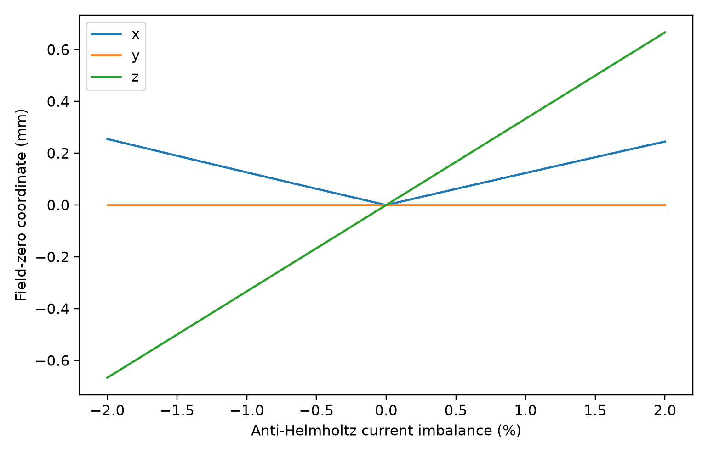

# Scientific results gallery

This gallery is the quickest way to see what the repository actually computes. Generated results include PNG figures, vector/data outputs where available, and metadata describing held-fixed parameters and fidelity limits.

**Interpretation guide:** a figure is a model result, not automatically an experimental prediction. Independent validation is labeled separately from internal checks, and scenario parameters are not presented as measured values.

## Independent validation

Generated with `python examples/generate_external_validation_results.py` using pinned optional QuTiP and PyLCP dependencies.

[Validation notes](validation/README.md) · [Detailed validation status](../docs/validation.md) · [Numerical data](validation/external_validation.npz)

Key matched residuals:

- two-level steady-state population vs QuTiP: maximum absolute difference `5.55e-17`;
- normalized 1-D two-beam force vs PyLCP: maximum relative difference about `7.9e-15`;
- 87Rb ground vector-Zeeman spectrum vs PyLCP: maximum difference about `0.57 Hz` over the tested fields.

These results validate the stated reduced cases, **not** the full 24-state multilevel MOT/PGC prediction.

## Atomic structure and vector Zeeman coupling

The complete 87Rb D2 ground/excited hyperfine manifolds use the full vector magnetic Hamiltonian rather than a projected `g_F m_F |B|` shift.

| Exact ground/excited spectra | Linear approximation versus exact result |
|---|---|
|  |  |
| [SVG](atomic_structure/exact_zeeman_spectra.svg) | [SVG](atomic_structure/linear_vs_exact_zeeman.svg) |

[Directional SVG](atomic_structure/zeeman_direction_covariance.svg) · [Numerical data](atomic_structure/vector_zeeman_reference.npz)

## Six physical laser beams

Each physical beam can carry its own power, direction, waist, pointing, optical phase/frequency, linewidth, coherence group, and Jones-optics train. Retroreflected and paired topologies are supported.

| Six-beam geometry | Controlled apparatus imperfections |
|---|---|
|  |  |

[Per-beam diagnostics](laser_apparatus/beam_diagnostics.csv) · [Numerical data](laser_apparatus/six_beam_apparatus.npz) · [Model notes](../docs/six_beam_apparatus.md)

For the specified effective-MOT reference recipe, a ±10% power error in one x beam moves the solved MOT centre by roughly `-0.74` to `+0.69 mm`; a 5 mrad pointing error gives roughly `36 um` displacement. These are recipe-specific effective-model sensitivities, not universal experimental tolerances.

## Magnetic apparatus and compensation

The magnetic layer includes segmented anti-Helmholtz coils, three independent Helmholtz bias axes, nonorthogonal calibration matrices, static/gradient backgrounds, 50/60-Hz harmonics, finite L/R switch-off, eddy-current components, and optional measured waveforms.

| Compensated field map | Field-zero sensitivity to imperfections |
|---|---|
|  |  |

[Imperfection table](magnetic_apparatus/imperfection_table.csv) · [Numerical data](magnetic_apparatus/magnetic_apparatus.npz) · [Model notes](../docs/magnetic_apparatus.md)

The committed calibration/background are synthetic examples. The model intentionally does not convert a static coherence change into a PGC temperature tolerance.

## Effective semiclassical MOT

Reference: 87Rb D2, six 10 mW beams, 8 mm waist, `delta=-2 Gamma`, radial gradient `0.10 T/m`.

| Apparatus geometry | Physical anti-Helmholtz field |
|---|---|
|  |  |
| [SVG](effective_mot/apparatus_geometry.svg) | [SVG](effective_mot/antihelmholtz_field.svg) |

| Force map | Deterministic trajectories |
|---|---|
|  |  |
| [SVG](effective_mot/force_map_x_vx.svg) | [SVG](effective_mot/deterministic_trajectories.svg) |

[Effective-model data](effective_mot/effective_mot_reference.npz). The force is a fast cycling-transition approximation; these trajectories are not an experimental capture prediction.

## Multilevel rate-equation MOT

Cooling and repump populations use the shared Wigner-generated 87Rb D2 basis.

| Effective versus multilevel force | Hyperfine populations |
|---|---|
|  |  |
| [SVG](multilevel/effective_vs_multilevel_force.svg) | [SVG](multilevel/manifold_populations.svg) |

[Multilevel data](multilevel/multilevel_reference.npz). Population rates neglect coherences, dark states, and true coherent polarization-gradient cooling.

## Optical-Bloch benchmarks

| Two-level steady state | Coherent transients |
|---|---|
|  |  |
| [SVG](optical_bloch/obe_steady_state.svg) | [SVG](optical_bloch/obe_transients.svg) |

[OBE data](optical_bloch/optical_bloch_reference.npz). The plotted benchmark is two-level. A full 24-state moving 87Rb D2 OBE is implemented and internally tested, but its complete multilevel force/populations are not yet independently validated.

## Polarization-gradient cooling and residual fields

Reference population-PGC case: coherent 87Rb D2 `F=2 -> F'=3`, `delta=-3 Gamma`, `s=0.08/beam`; phases and coherence groups are stored in configuration/data.

| Polarization lattice | Light shifts and pumping |
|---|---|
|  |  |
| [SVG](polarization_gradient/polarization_lattice.svg) | [SVG](polarization_gradient/light_shifts_pumping.svg) |

| Velocity force | Full-vector residual-field OBE diagnostic |
|---|---|
|  |  |
| [SVG](polarization_gradient/subdoppler_force_velocity.svg) | [Numerical data](polarization_gradient/vector_residual_obe.npz) |

[Population-PGC data](polarization_gradient/polarization_gradient_reference.npz).

The adiabatic population model omits ground coherences. The full-vector OBE diagnostic retains vector Zeeman mixing and coherences but is currently a static/point diagnostic. The approximately `9.4 mG` Larmor-versus-pumping crossing for the configured recipe is a **timescale marker**, not a quantitative temperature threshold. No OBE-inconsistent `T(B)` is reported.

## Time-sequenced experimental cycle

The illustrative sequence connects MOT loading, compressed MOT, gradient switch-off, field settling, PGC ramp, molasses hold, and release/TOF with finite coil and eddy-current response.

| Laboratory-control timeline | Timing / field-settling sensitivity |
|---|---|
|  |  |

[Numerical data](sequence/sequence_reference.npz) · [Model notes](../docs/experimental_sequences.md)

The plotted kinetic quantity is an effective damping/recoil proxy, **not** a coherent PGC temperature or claimed experimental optimum.

## Damping, power, and beam-waist capture

| Damping versus scattering | Fixed-power waist/capture tradeoff |
|---|---|
|  |  |
| [SVG](parameter_studies/damping_power_physics.svg) | [SVG](parameter_studies/beam_waist_capture.svg) |

[Parameter-study data](parameter_studies/parameter_studies.npz). Scattering can rise while the velocity slope falls after saturation/power broadening; the capture panel is a finite speed-grid acceptance proxy rather than a steady atom-number prediction.

## Vapour capture, loading, and loss

The incident ensemble uses the surface-flux speed law and cosine angular law. Stratified rare-event sampling, Wilson intervals, adaptive high-speed tails, and a speed/impact-parameter response map make the trajectory-derived loading calculation inspectable.

| Vapour pressure and trajectory-derived loading | Loading-loss sensitivity |
|---|---|
|  |  |
| [SVG](capture_loading/vapor_capture_loading.svg) | [SVG](capture_loading/loading_loss_sensitivity.svg) |

| Capture sampling convergence | Speed/impact-parameter response |
|---|---|
|  |  |
| [SVG](capture_loading/capture_sampling_convergence.svg) | [SVG](capture_loading/capture_response_map.svg) |

| Effective versus selected multilevel trajectories | Loading versus beam waist |
|---|---|
|  |  |
| [SVG](capture_loading/effective_multilevel_capture_comparison.svg) | [SVG](capture_loading/loading_vs_beam_waist.svg) |

[Numerical data and metadata](capture_loading/capture_loading_reference.npz).

The capture sphere is an acceptance boundary, not a chamber wall. Background/hot-Rb collision coefficients and two-body losses remain sourced or user/calibration inputs rather than invented defaults.

## Collective Gaussian MOT mean field

The optional collective extension adds a Gaussian density profile, two-body loss, Beer-Lambert shadowing, a Walker/Sesko/Wieman-style multiple-scattering mean field, optical-depth diagnostics, and a radiation-trapping recoil proxy.

[Parameter provenance](collective_mot/parameter_provenance.csv) · [Numerical data](collective_mot/collective_mot.npz) · [Model notes](../docs/collective_mot.md)

The committed run demonstrates loading saturation, cloud expansion, density limitation, optical depth, shadowing and multiple-scattering scales using explicitly labeled user scenarios. It is **not exact radiative transfer** and is not experimentally calibrated.

## Cold-atom foundations

| Dipole potential | Gaussian propagation |
|---|---|
|  |  |
| [SVG](foundations/trap_potential.svg) | [SVG](foundations/beam_waist.svg) |

| Time of flight | Thermal velocity |
|---|---|
|  |  |
