# Scientific results gallery

Every displayed result has a GitHub-friendly PNG, a vector SVG, and compact NPZ
data where useful. Generated formats remain binary in Git diffs. These are model
diagnostics, not fitted measurements.

## Atomic structure and vector Zeeman coupling

Generated with `python examples/generate_vector_zeeman_results.py`. The complete
87Rb D2 ground/excited hyperfine manifolds use the full vector magnetic
Hamiltonian rather than a projected `g_F m_F |B|` shift.

| Exact ground/excited spectra | Linear approximation versus exact result |
|---|---|
| 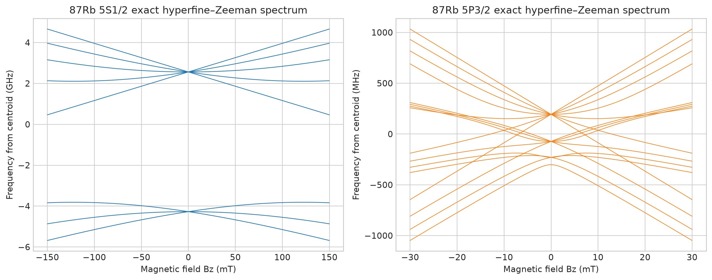 | 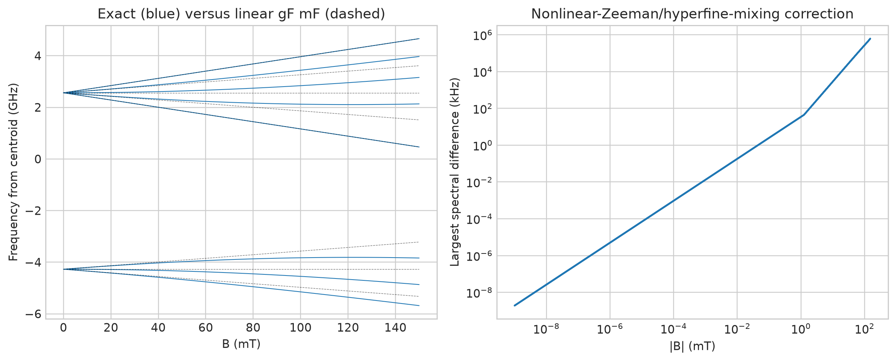 |
| [SVG](atomic_structure/exact_zeeman_spectra.svg) | [SVG](atomic_structure/linear_vs_exact_zeeman.svg) |

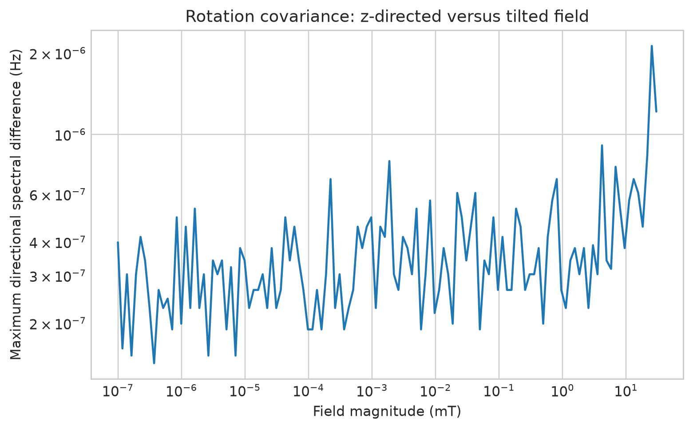

[Directional SVG](atomic_structure/zeeman_direction_covariance.svg) ·
[Numerical data](atomic_structure/vector_zeeman_reference.npz)

## Effective semiclassical MOT and apparatus

Reference: 87Rb D2, six 10 mW beams, 8 mm waist, δ=−2Γ, radial gradient
0.10 T/m. Generated with `python examples/generate_effective_mot_results.py`.

| Apparatus geometry | Physical anti-Helmholtz field |
|---|---|
| 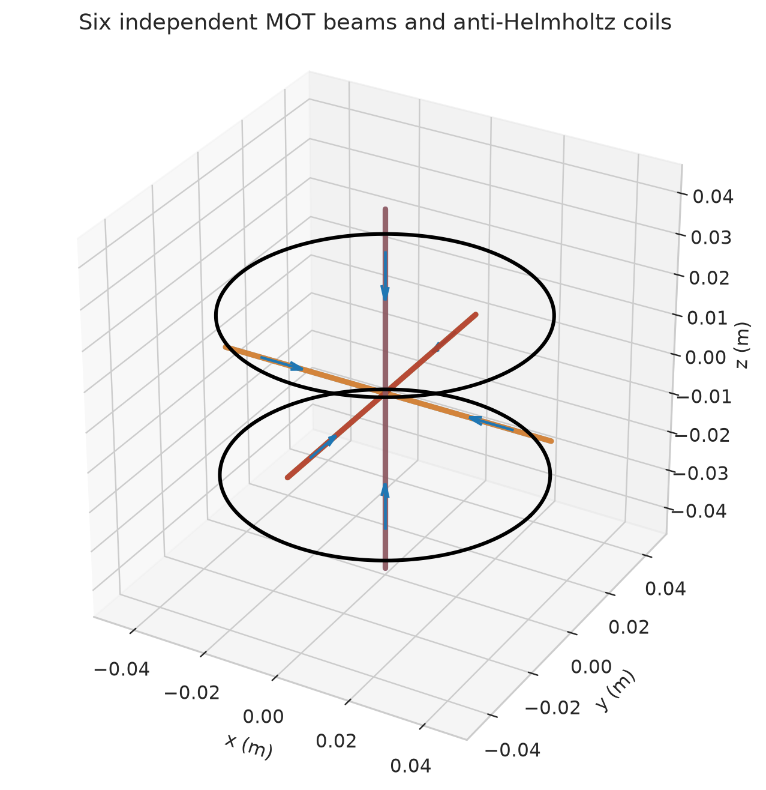 |  |
| [SVG](effective_mot/apparatus_geometry.svg) | [SVG](effective_mot/antihelmholtz_field.svg) |

| Force map | Deterministic trajectories |
|---|---|
| 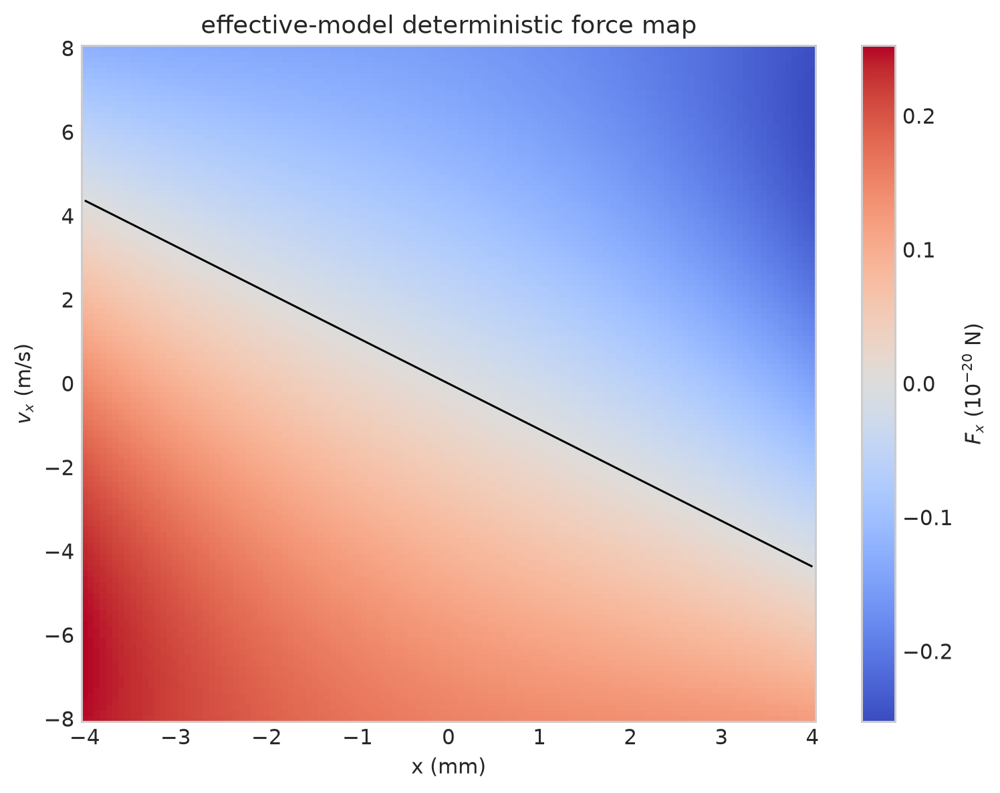 |  |
| [SVG](effective_mot/force_map_x_vx.svg) | [SVG](effective_mot/deterministic_trajectories.svg) |

[Effective-model data](effective_mot/effective_mot_reference.npz). The force is a
cycling-transition approximation; trajectories are not capture/loading predictions.

## Multilevel rate-equation MOT

Generated with `python examples/generate_multilevel_results.py`. Cooling and
repump populations use the shared Wigner-generated 87Rb D2 basis.

| Effective versus multilevel force | Hyperfine populations |
|---|---|
| 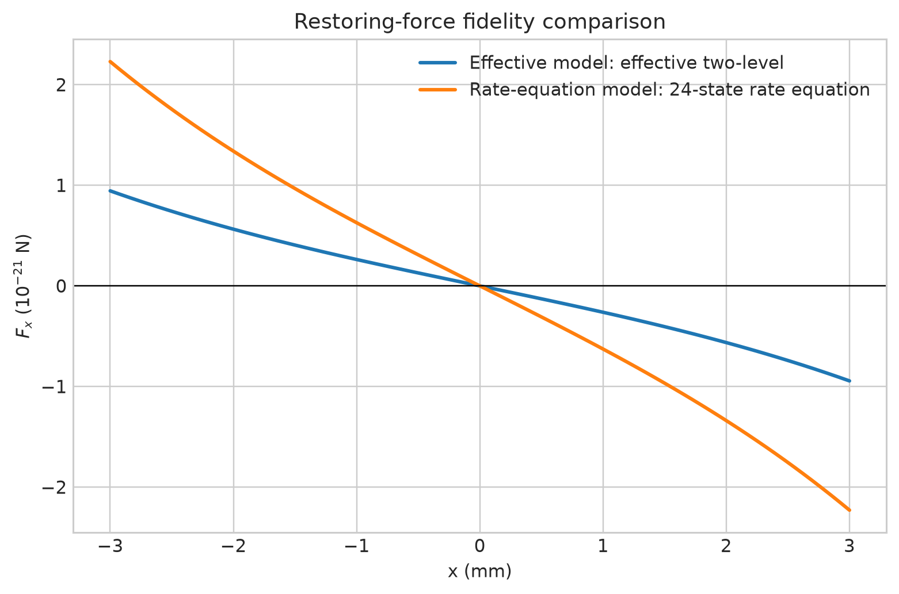 | 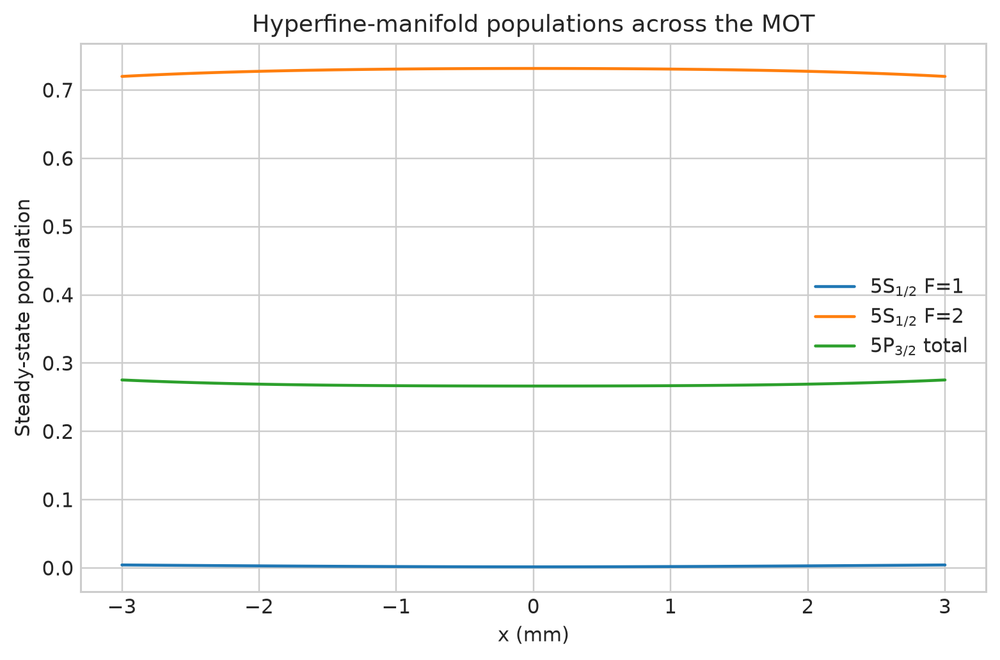 |
| [SVG](multilevel/effective_vs_multilevel_force.svg) | [SVG](multilevel/manifold_populations.svg) |

[Multilevel data](multilevel/multilevel_reference.npz). Population rates neglect
coherences, dark states and true polarization-gradient cooling.

## Optical-Bloch benchmarks

| Two-level steady state | Coherent transients |
|---|---|
| 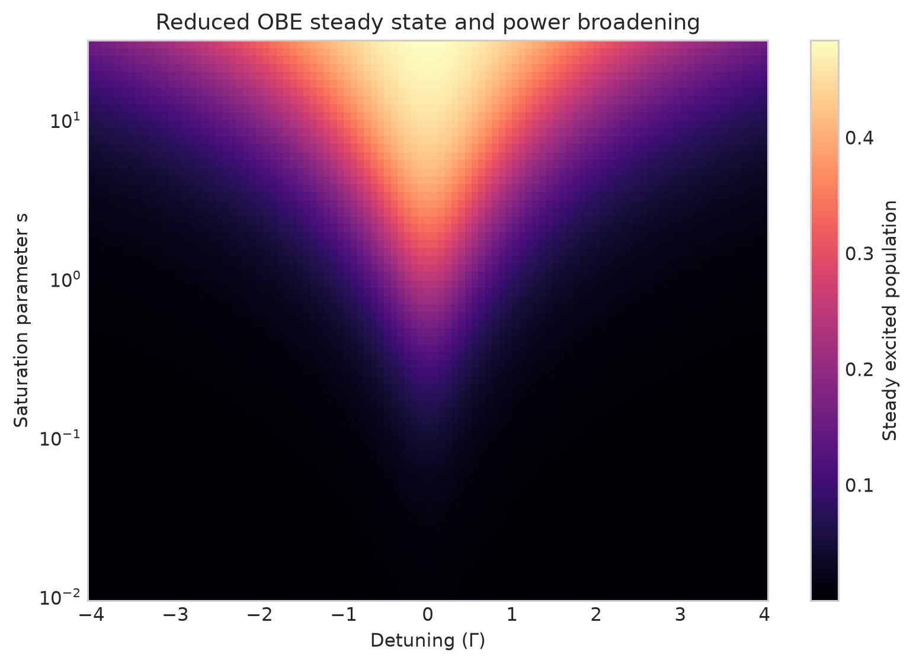 | 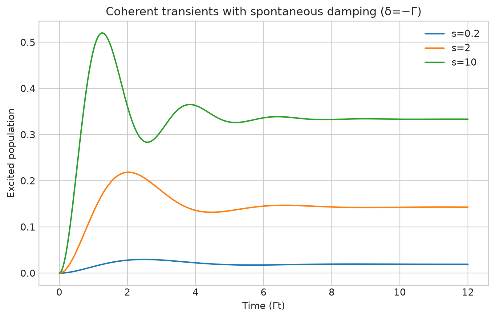 |
| [SVG](optical_bloch/obe_steady_state.svg) | [SVG](optical_bloch/obe_transients.svg) |

[OBE data](optical_bloch/optical_bloch_reference.npz). This plotted benchmark is
two-level; the sparse multilevel operator framework is tested but not presented
as a validated full six-beam result.

## Polarization-gradient cooling

Reference: coherent 87Rb D2 F=2→F′=3, δ=−3Γ, s=0.08/beam; phases and coherence
groups are stored in configuration/data. Generated with
`python examples/generate_polarization_gradient_results.py`.

| Polarization lattice | Light shifts and pumping |
|---|---|
| 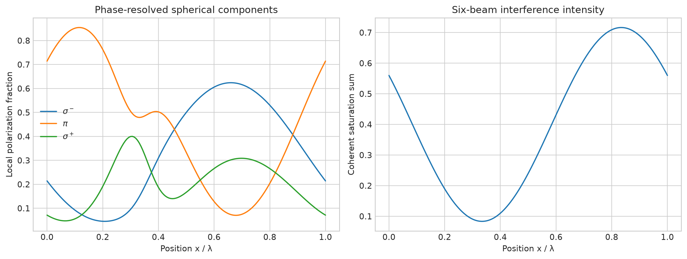 | 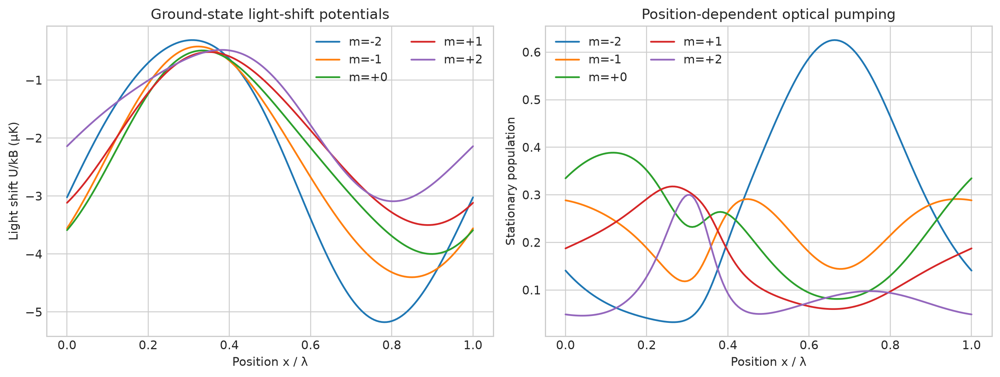 |
| [SVG](polarization_gradient/polarization_lattice.svg) | [SVG](polarization_gradient/light_shifts_pumping.svg) |

| Velocity force | Field/laser sensitivity |
|---|---|
| 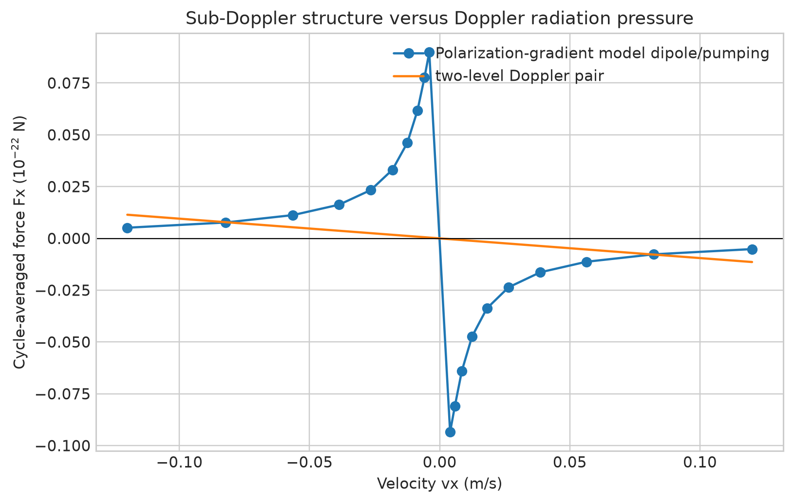 | 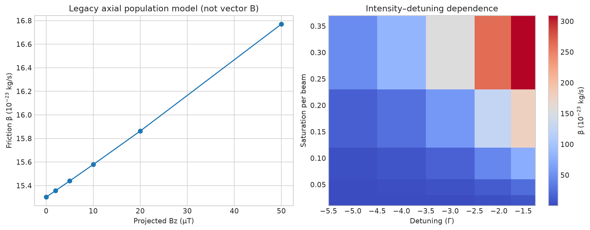 |
| [SVG](polarization_gradient/subdoppler_force_velocity.svg) | [SVG](polarization_gradient/subdoppler_sensitivities.svg) |

[Polarization-gradient data](polarization_gradient/polarization_gradient_reference.npz).
The adiabatic population model omits ground coherences and does not yield a
quantitative gray-molasses or experimental temperature prediction.

## Damping, power and beam-waist capture

Generated with `python examples/generate_parameter_studies.py`; constraints and
capture criterion are stored in [data](parameter_studies/parameter_studies.npz).

| Damping versus scattering | Fixed-power waist/capture tradeoff |
|---|---|
| 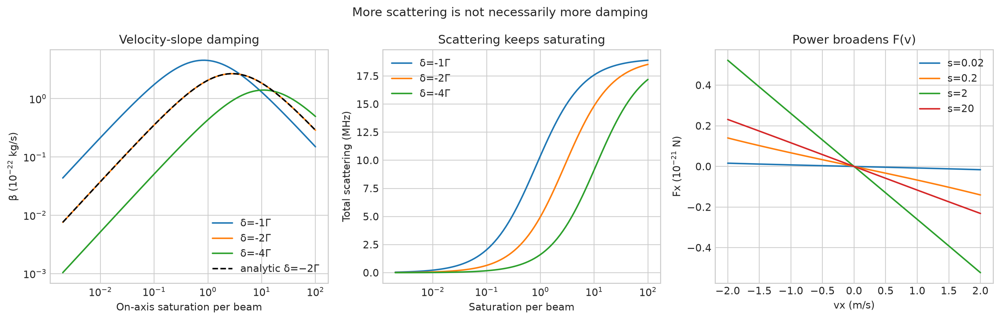 | 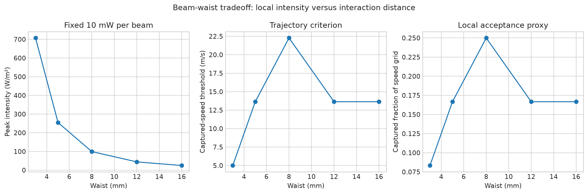 |
| [SVG](parameter_studies/damping_power_physics.svg) | [SVG](parameter_studies/beam_waist_capture.svg) |

The first plot demonstrates that scattering can rise while the velocity slope
β falls after saturation/power broadening. The second is a finite speed-grid
acceptance proxy, not a steady atom-number prediction.

## Vapour capture, loading, and loss

Generated with `python examples/generate_capture_loading_results.py` from the
effective 87Rb D2 force and `configs/rb_vapor_loading.yaml`.

| Vapour pressure and trajectory-derived loading | Loading-loss sensitivity |
|---|---|
| 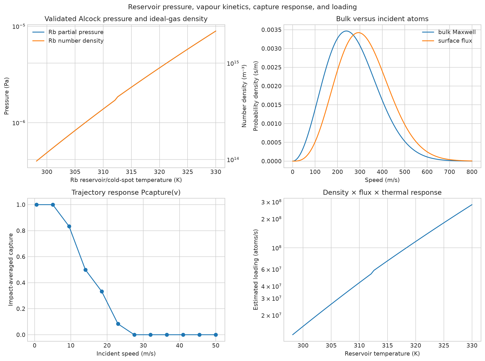 | 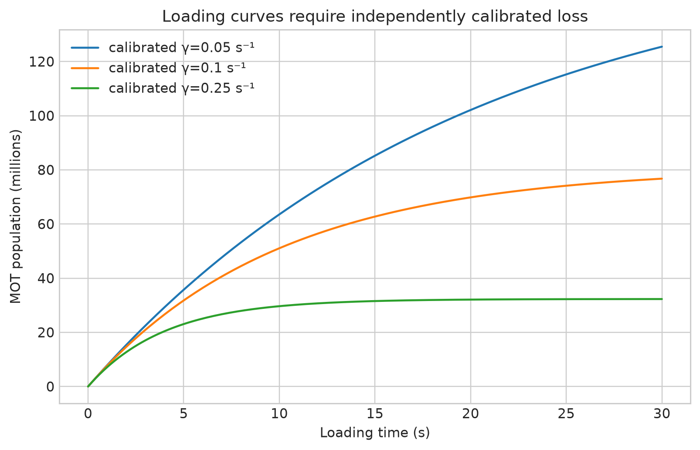 |
| [SVG](capture_loading/vapor_capture_loading.svg) | [SVG](capture_loading/loading_loss_sensitivity.svg) |

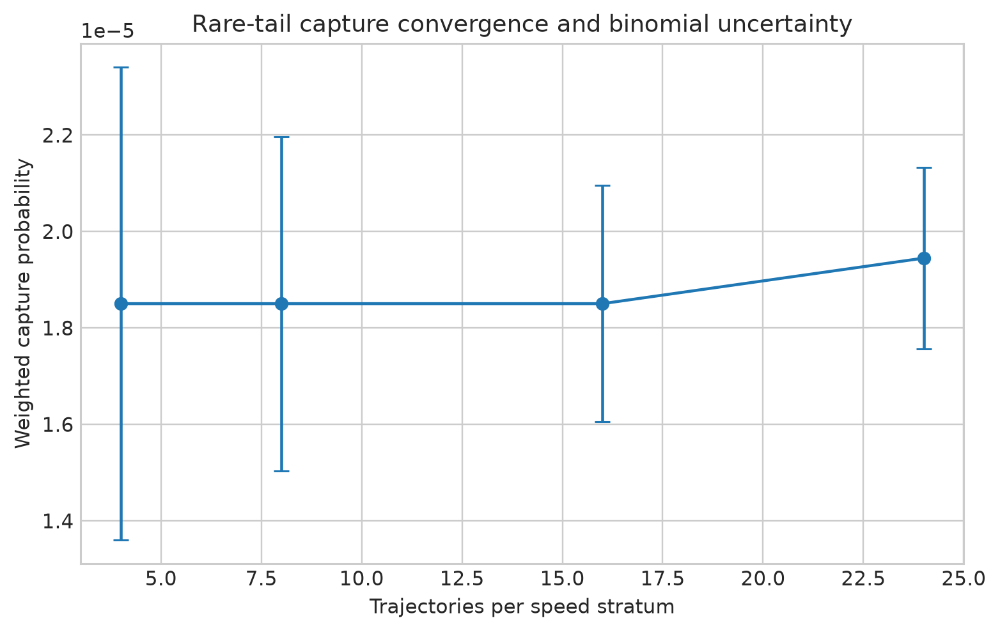

[Convergence SVG](capture_loading/capture_sampling_convergence.svg)

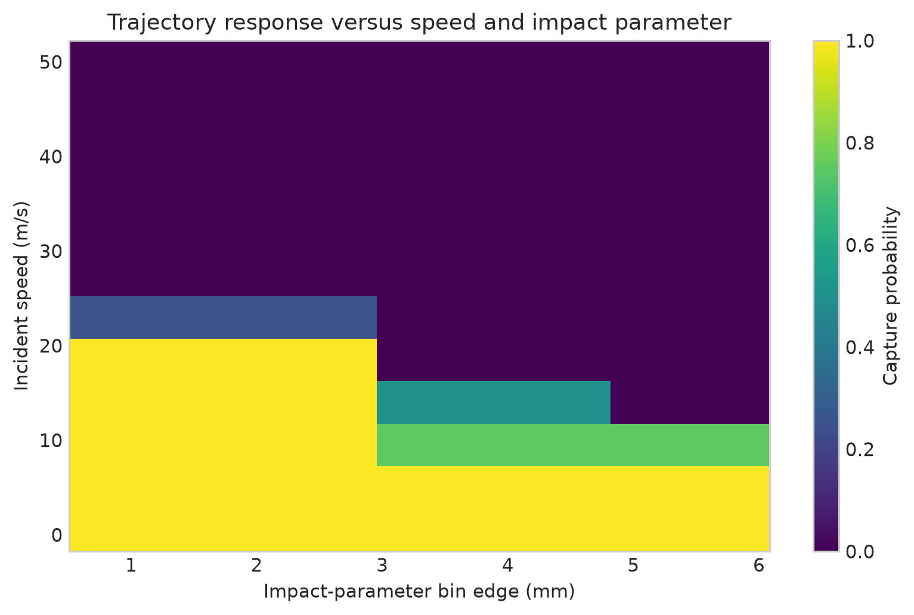

[Response-map SVG](capture_loading/capture_response_map.svg)

[Numerical data and metadata](capture_loading/capture_loading_reference.npz).
The incident ensemble uses the surface-flux speed law and cosine angular law,
with stratification and Wilson intervals to resolve the rare slow tail. The
temperature-independent `P_capture(v,b)` response is integrated against each
temperature's flux distribution. Adaptive geometric tail strata report the
last speed and an upper confidence bound rather than declaring zero capture.
The capture sphere is an acceptance boundary rather than a chamber model.
Background and hot-Rb loss rates are
independent calibrated inputs. The plotted atom numbers are scenarios, not an
experimentally validated population prediction.

| Effective versus multilevel trajectories | Loading versus beam waist |
|---|---|
| 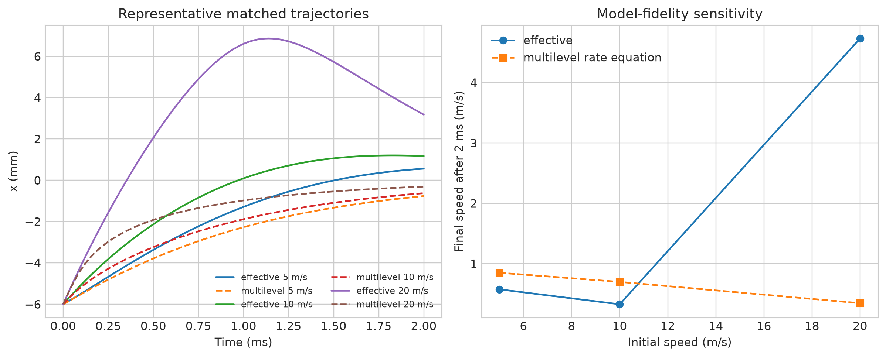 | 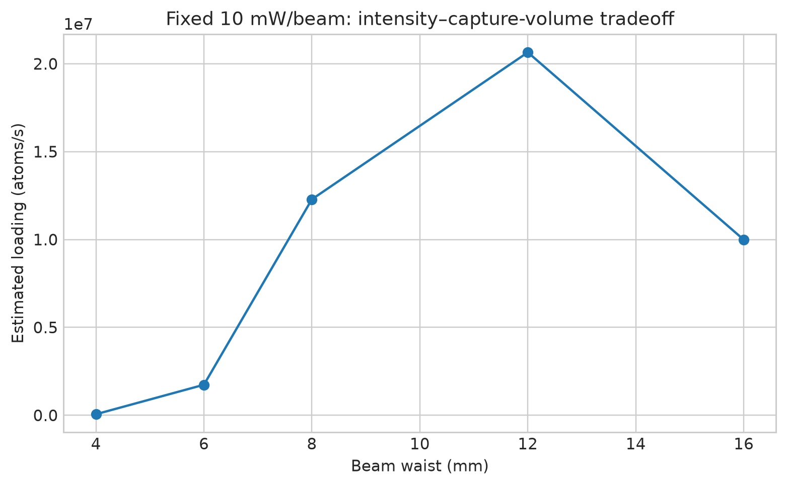 |
| [SVG](capture_loading/effective_multilevel_capture_comparison.svg) | [SVG](capture_loading/loading_vs_beam_waist.svg) |

## Cold-atom foundations

| Dipole potential | Gaussian propagation |
|---|---|
| 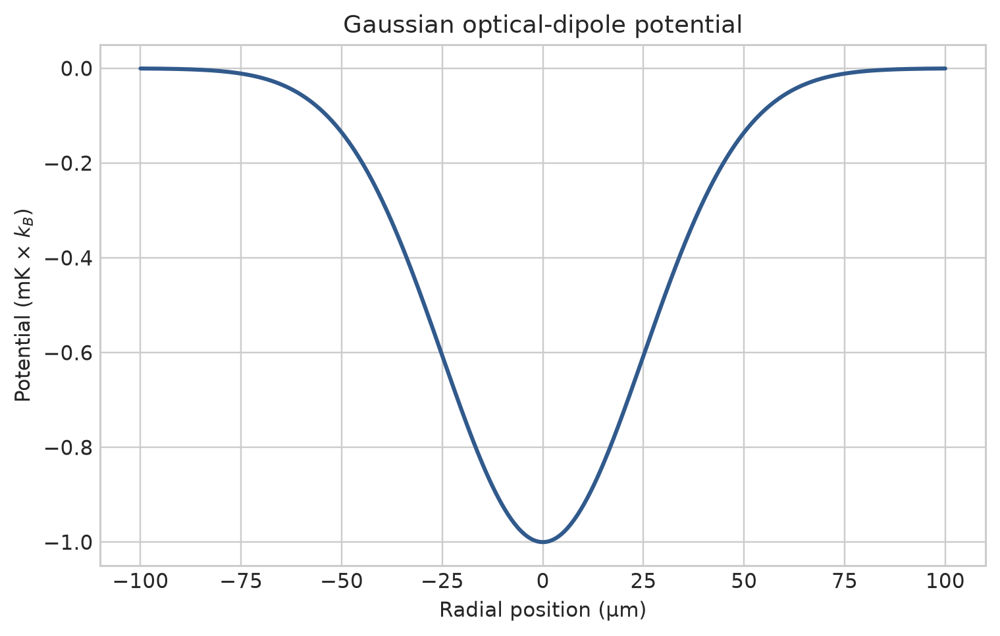 |  |
| [SVG](foundations/trap_potential.svg) | [SVG](foundations/beam_waist.svg) |

| Time of flight | Thermal velocity |
|---|---|
| 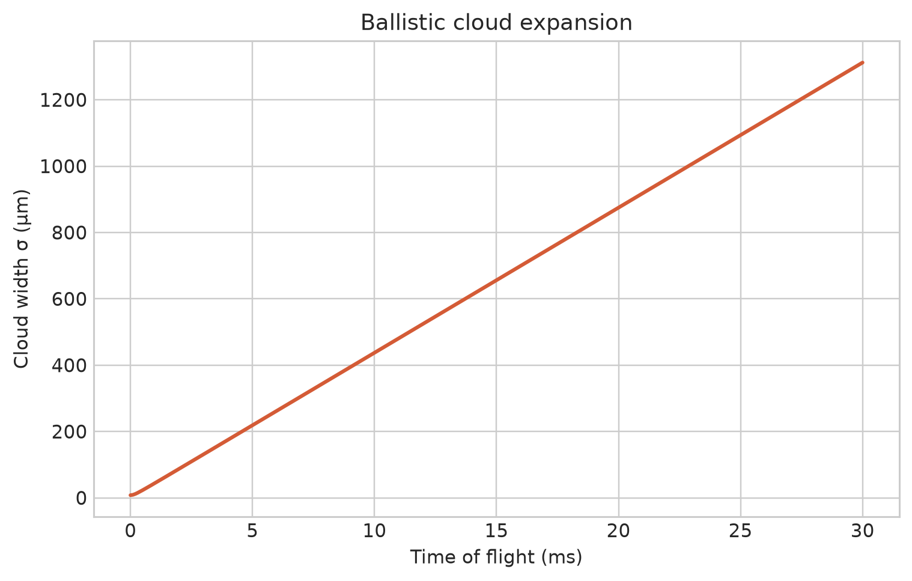 | 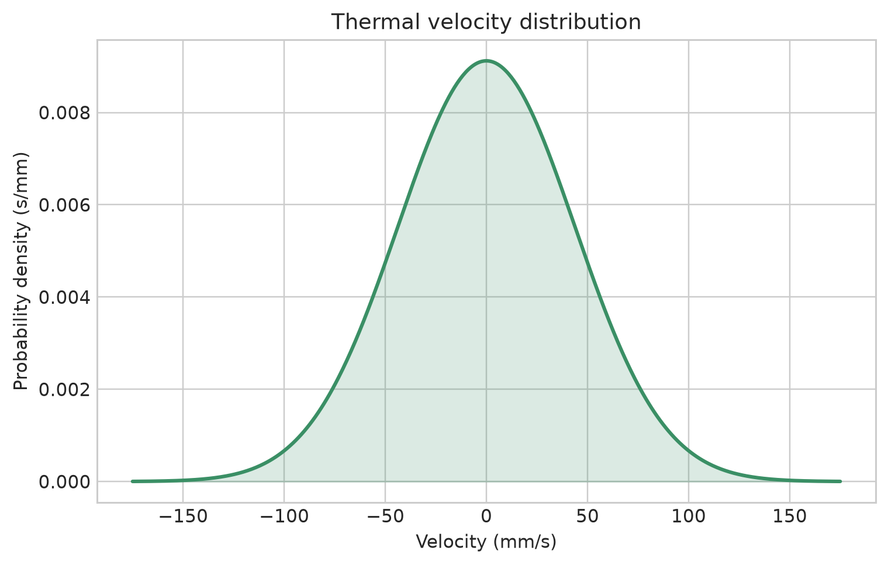 |
