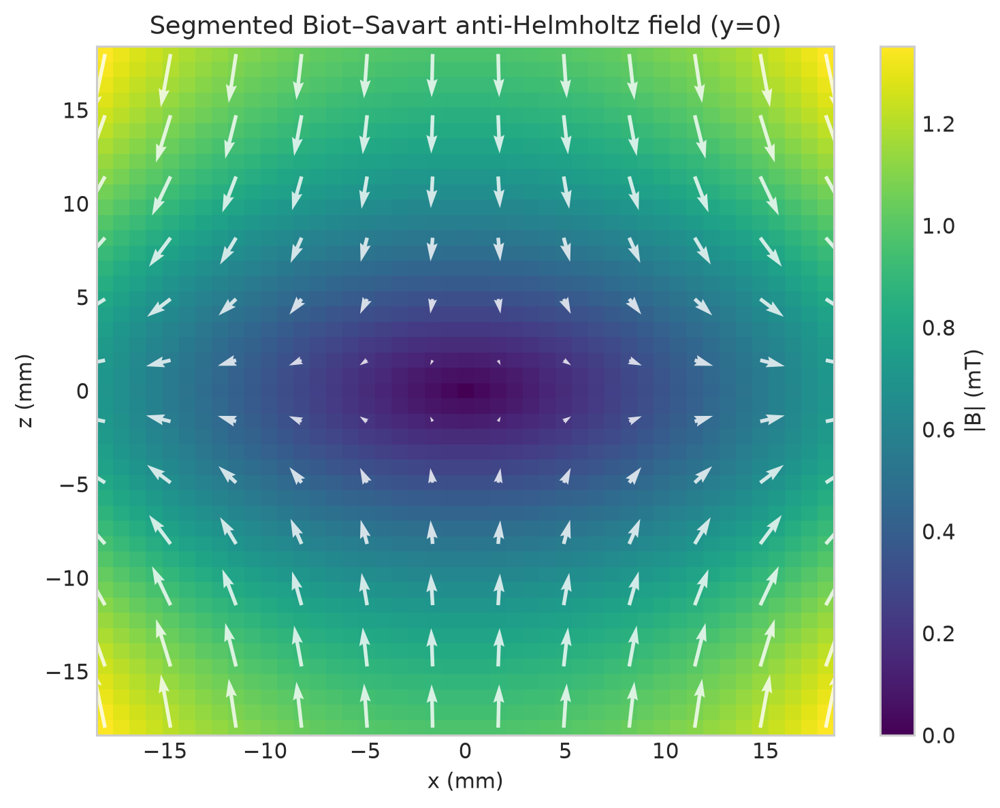
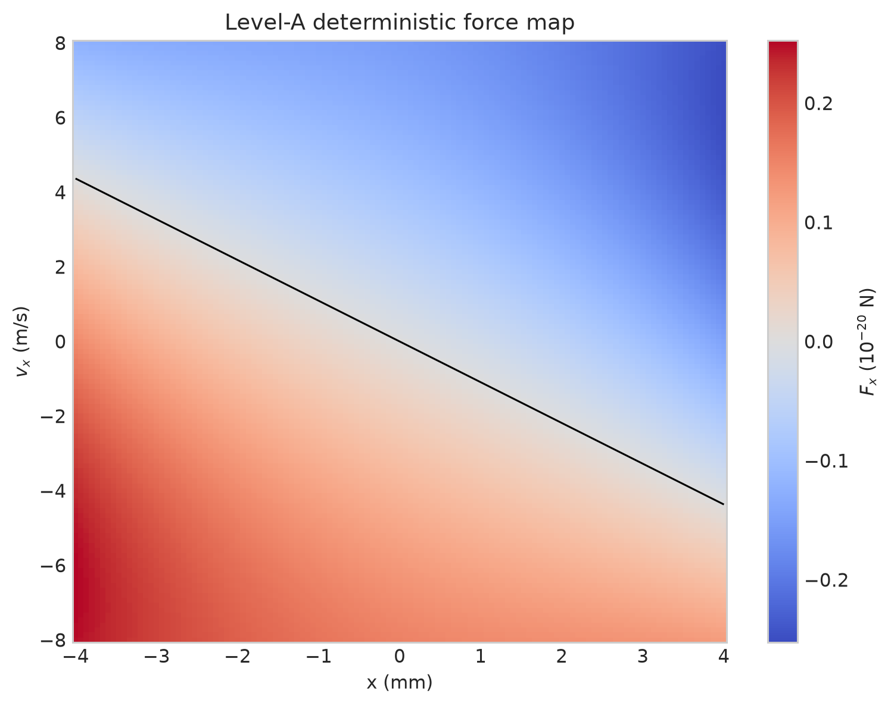
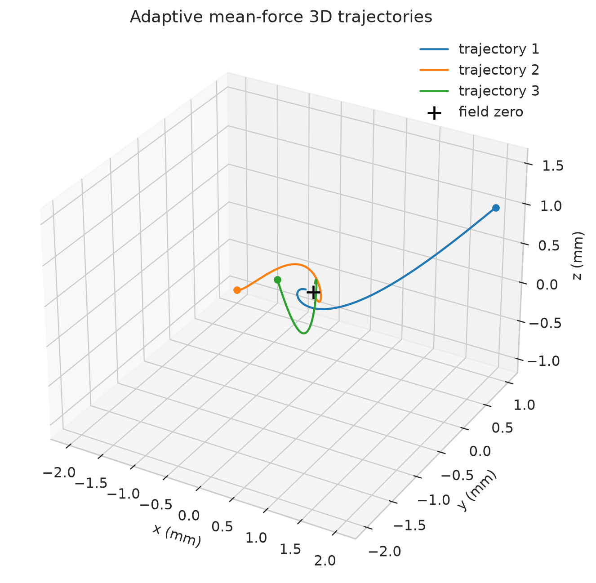
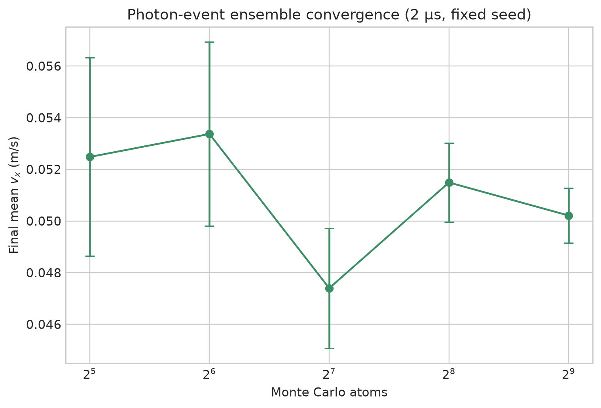
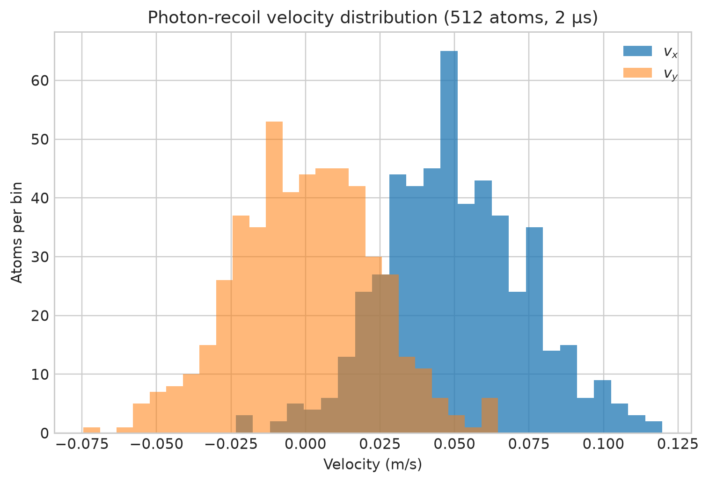
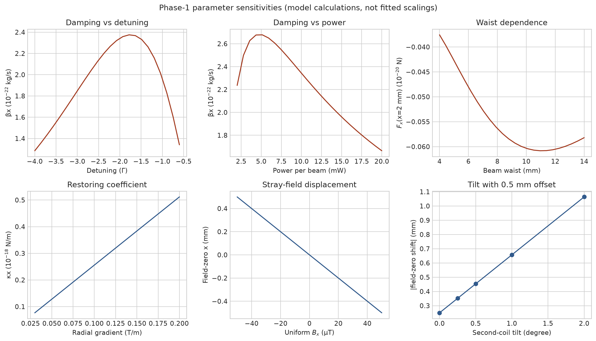
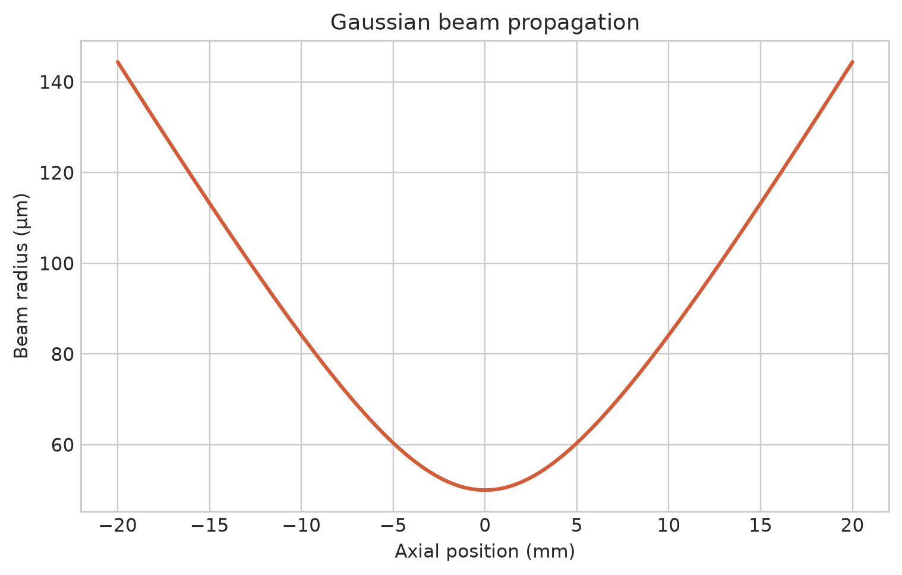
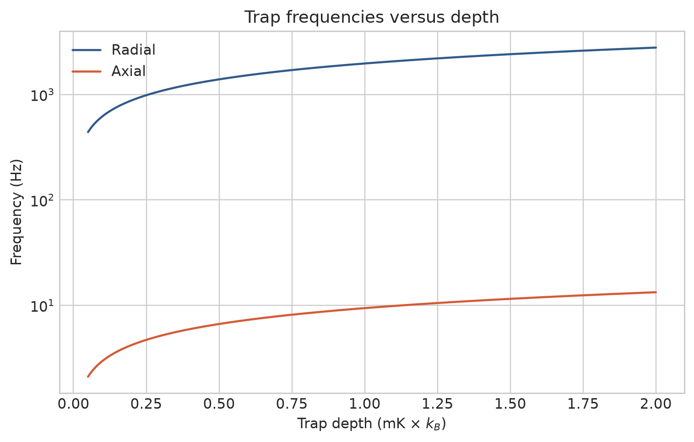
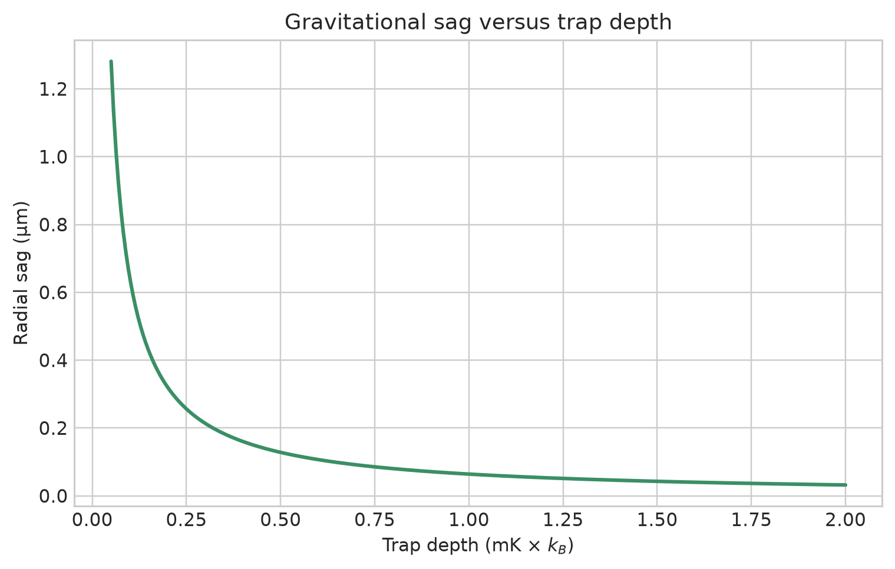

# Simulation results gallery

This page is the visual index for the repository's committed simulation results.
All embedded images are PNG files so they render directly on GitHub. Each
scientific plot links to an SVG vector version, and Phase-1 arrays are stored in
[`phase1/phase1_reference.npz`](phase1/phase1_reference.npz).

> **Fidelity notice:** Phase-1 results use the documented Level-A effective
> two-level semiclassical/stochastic model. They are internal physics and
> numerical diagnostics, not fitted measurements or calibrated predictions of a
> particular vapour-cell MOT. See [theory](../docs/theory.md) and
> [validation](../docs/validation.md).

## Reference configuration

| Parameter | Reference value |
|---|---:|
| Atom/transition | 87Rb D2 effective F=2 → F′=3 cycling transition |
| Wavelength | 780.241209686 nm |
| Cooling power | 10 mW per beam |
| Gaussian 1/e² waist | 8 mm |
| Detuning | −2 Γ |
| Ideal radial quadrupole gradient | 0.10 T/m |
| Gravity | (0, 0, −9.80665) m/s² |
| Monte Carlo seed | 20260811 |
| Photon-event timestep | 5 ns |
| Largest displayed ensemble | 512 atoms |
| Physical-coil quadrature | 256 segments per loop |

The physical field figure uses a separate anti-Helmholtz geometry: 40 mm radius,
40 mm separation, 50 turns per coil and 2 A. This separation is intentional: it
validates the geometrical coil backend independently, while the force and
trajectory figures use the ideal quadrupole reference configuration.

Regenerate the Phase-1 dataset and all paired figure formats with:

```bash
python examples/generate_phase1_results.py
```

## 1. Apparatus geometry


**What is shown.** Three counter-propagating beam pairs intersect at the nominal
field zero, surrounded by an opposed-current circular-coil pair. Arrows indicate
individual propagation directions rather than treating each axis as one beam.
The visualization uses the 8 mm beam configuration and 40 mm coil geometry; line
width is schematic and is not a rendered Gaussian intensity isosurface.

[Vector SVG](phase1/apparatus_geometry.svg) ·
[configuration](../configs/rb87_standard_mot.yaml)

## 2. Geometrical anti-Helmholtz magnetic field



**What is shown.** The colour scale is |B| in mT in the y=0 plane; white arrows
show the x-z field direction. The central zero and stronger axial gradient are
the expected near-centre anti-Helmholtz behaviour. The field is calculated from
segmented-wire Biot–Savart integration—not from the analytical linear
quadrupole—and the 128→256 segment refinement is tested separately.

[Vector SVG](phase1/antihelmholtz_field.svg) ·
[numerical arrays](phase1/phase1_reference.npz) ·
[magnetic-method documentation](../docs/numerical_methods.md#biotsavart-quadrature)

## 3. Deterministic force map



**What is shown.** The Level-A x force is evaluated over position and velocity
with all six Gaussian beams competing through the shared saturation denominator.
The black zero-force contour separates positive and negative acceleration. Near
the origin its slope has both the restoring and damping signs expected for the
configured red detuning. It must not be interpreted as a multilevel or
sub-Doppler force surface.

[Vector SVG](phase1/force_map_x_vx.svg) ·
[numerical arrays](phase1/phase1_reference.npz) ·
[force equation](../docs/theory.md#radiation-pressure)

## 4. Adaptive deterministic trajectories



**What is shown.** Three initial phase-space points are propagated for 4 ms with
adaptive RK45 integration of the configured mean force and full gravity vector.
The plus symbol is the nominal ideal field zero. These examples demonstrate 3D
restoring/damping dynamics; no numerical capture criterion is applied, so the
curves are deliberately called trajectories rather than captured atoms.

[Vector SVG](phase1/deterministic_trajectories.svg) ·
[solver documentation](../docs/numerical_methods.md#deterministic-integration)

## 5. Photon-event Monte Carlo convergence



**What is shown.** Final mean x velocity after 2 µs is plotted for 32–512 atoms,
with standard errors, fixed initial velocity, 5 ns timestep and seed 20260811.
The shrinking uncertainty and stabilization illustrate sampling convergence; the
short run is a numerical diagnostic, not an equilibrium-temperature estimate.

[Vector SVG](phase1/monte_carlo_convergence.svg) ·
[numerical arrays](phase1/phase1_reference.npz) ·
[Monte Carlo method](../docs/numerical_methods.md#photon-event-integration)

## 6. Photon-recoil velocity distribution



**What is shown.** The x and y velocity marginals of the 512-atom, 2 µs run show
both directed absorption and random isotropic spontaneous-emission recoil. The
solver applies +ℏk for the selected absorption beam and the opposite momentum of
the emitted photon. The distribution is not fitted to a Maxwellian because this
short transient is not expected to be thermal.

[Vector SVG](phase1/recoil_velocity_distribution.svg) ·
[numerical arrays](phase1/phase1_reference.npz)

## 7. Beam and magnetic parameter sensitivities



**What is shown.** Every curve is recalculated from the force or Biot–Savart
model, not imposed through empirical visual scaling. The panels show damping
versus detuning and beam power, off-axis force versus waist, restoring
coefficient versus gradient, analytical ideal-zero displacement versus uniform
Bx, and geometrical field-zero motion for 0–2° second-coil tilt with a fixed
0.5 mm lateral offset. These are sensitivity diagnostics, not an optimization of
an experimentally calibrated MOT.

[Vector SVG](phase1/parameter_sensitivities.svg) ·
[numerical arrays](phase1/phase1_reference.npz) ·
[misaligned-coil example](../configs/rb87_misaligned_coils.yaml)

## Foundational-model gallery

These earlier plots remain useful educational checks, but they are not outputs
of the six-beam MOT framework.

| Gaussian optical-dipole potential | Gaussian beam waist |
|---|---|
|  |  |
| [SVG](trap_potential.svg) | [SVG](beam_waist.svg) |

| Ballistic time-of-flight width | Thermal velocity distribution |
|---|---|
|  |  |
| [SVG](time_of_flight.svg) | [SVG](thermal_velocity.svg) |

| Harmonic trap frequencies | Gravitational sag |
|---|---|
|  |  |
| [SVG](trap_frequencies.svg) | [SVG](gravitational_sag.svg) |

The foundational numerical summary is in [`summary.md`](summary.md), and the
plots can be regenerated with `python results/generate_results.py`.
